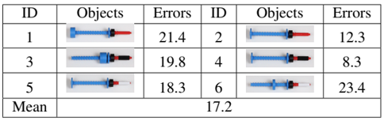
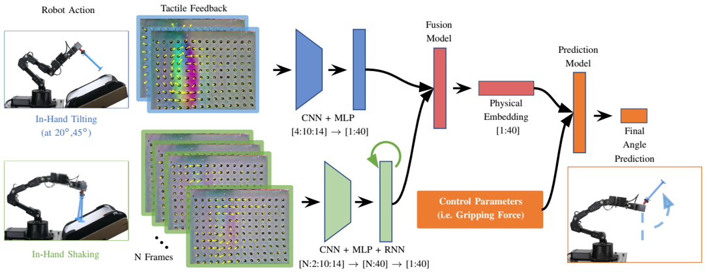

# 2020
* **Generative Pre-trained Transformer 3** (**GPT-3**)
  * title and link: [Language Models are Few-Shot Learners](https://arxiv.org/abs/2005.14165)
  * information: NeurIPS 2020 outstanding paper OpenAI (Ilya Sutskever)
  * problem and position: want to remove task-specific finetuning for GPT after task-agnostic pre-training
  * method overview: scale up to 175B parameters and without finetuning but with in-context learning
  * teaser: 
    
  * results: finding: while zero-shot performance improves steadily with model size, few-shot performance increases more rapidly, demonstrating that larger models are more proficient at in-context learning
    
  * method details: 
    * model are the same as GPT-2, just scale up
      
    * dataset from Common Crawl, but filter to improve quality and mix with other high-quality datasets, training not all but sample according to quality as weight for overall 300B tokens
      
    * training for larger model using larger batch size but smaller learning rate, loss almost log decreasing
      

* **Learning and Influencing Latent Intent** (**LILI**)
  * title and link: [Learning Latent Representations to Influence Multi-Agent Interaction](https://arxiv.org/abs/2011.06619)
  * information: CoRL 2020 best paper Stanford (Chelsea Finn, Dorsa Sadigh)
  * problem and position: learn latent strategy dynamics of other agent and then influence other agent's strategy to achieve high cumulative reward across many interactions
  * method overview: autoencoder-like learn latent representation and RL learn policy conditioning on latent representation
  * results: 
    
  * method details: 
    * many interactions with other agent, want to achieve high cumulative reward across interactions
    * assume other agent's high-level intention represented by latent variable $z$, during each interaction $z_i$ is constant but $z_i$ changes between interactions due to last ego agent interaction $\tau_{i-1}$, also influence this time ego agent interaction $\tau_i$
    * intuition is that ego agent can use its strategy to influence other agent to get long-term reward
    * latent representation learning: auto-regressive encoder $E(z^i \mid \tau^{i-1})$ and decoder $D(\tau^i \mid z^i)$, then $E$ can be used as latent strategy prediction
    * RL learns to action $\pi(a \mid s, z^i)$ conditioning on latent strategy and optimize cumulative rewards across interactions
    

* **Swing Robot** (**SwingBot**)
  * title and link: [SwingBot: Learning Physical Features from In-hand Tactile Exploration for Dynamic Swing-up Manipulation](https://arxiv.org/abs/2101.11812)
  * information: IROS 2020 best paper MIT
  * problem and position: swing up unseen objects to a specific pose
  * method overview: two exploration actions collect tactile information from GelSight and network extracts physical feature from the tactile information and network learns forward dynamics from the physical feature
  * teaser: 
    
  * results: 
    
  * method details: 
    * different physical properties lead to different tactile responses in tilting and shaking actions
    * tilting mainly for mass, center of mass and moment of inertia, shaking mainly for friction, but only in sense, actually no these physical properties explicit supervision
    
    * during training, the pipeline can be trained end-to-end since tactile data and control parameters as input and final angle as output all known
    * during inference, first do 2 exploration actions to collect tactile data, a set of control parameters are sampled, then choose output angle closest to target as chosen control action
    

* **Pitch-, Rhythm-, and Dynamics-aware embeddings** (**PiRhDy**)
  * title and link: [PiRhDy: Learning Pitch-, Rhythm-, and Dynamics-aware Embeddings for Symbolic Music](https://arxiv.org/abs/2010.08091)
  * information: ACM MM 2020 best paper
  * problem and position: learn embeddings for symbolic music
  * method overview: make use of symbolic music features, hierarchical token modeling and then context modeling
  * results: finetuning in 3 downstream tasks SOTA
    
  * method details: 
    * 2 motivations: 
      * musical tokens have pitch, rhythm and dynamics features
      * musical tokens are in melodic and harmonic contexts
    * hierarchical modeling: token modeling and context modeling
    
    

* **Recurrent All-pairs Field Transforms** (**RAFT**)
  * title and link: [RAFT: Recurrent All-Pairs Field Transforms for Optical Flow](https://arxiv.org/abs/2003.12039)
  * information: ECCV 2020 best paper Princeton (Jia Deng)
  * problem and position: SOTA optical flow estimation
  * method overview: feature extraction and similarity correlation and iterative update
  * results: 5.10% F1-all error on KITTI, 2.855 pixels end-point-error on Sintel
    
  * method details: 
    * motivated by traditional optimization-based method, follow their pipeline but change to learnable
    * feature encoder $g_{\theta}$ as CNN extracts feature for both $I_1, I_2$ as $R^{H \times W \times 3} \rightarrow R^{H/8 \times W/8 \times D=256}$
    * context encoder $h_{\theta}$ same as $g_{\theta}$ extracts feature for only $I_1$
    * similarity correlation for $g_{\theta}(I_1)$ and $g_{\theta}(I_2)$ as dot product $C \in R^{H \times W \times H \times W}$
    * iterative update by GRU, input $x_k$ as concatenation of correlation feature, flow feature and context feature, output as flow update $\Delta f_k$
    * correlation feature as look up in $C$ by indexing $(u, v)$ and $(u + f_k^1, v + f_k^2)$ and CNN
    * flow feature as CNN on $f_k$
    * context feature from context encoder
    * output as CNN on hidden state $h_k$
    * supervision as discounted $l_1$ loss
      
    

* **Deep Sets for Symmetric elements** (**DSS**)
  * title and link: [On Learning Sets of Symmetric Elements](https://arxiv.org/abs/2002.08599)
  * information: ICML 2020 outstanding paper Nvidia
  * problem and position: principled approach dealing with learning unordered set of general symmetric elements
  * method overview: prove principles of designing network for symmetric set elements
  * results: 
    
  * method details: 
    * $X = \{x_1, \ldots, x_n\} \in R^{n \times d}$ symmetry equivariant groups $G = S_n \times H$: $S_n$ as permutation on $x$s order like reordering point cloud and $H$ as the same change on all $x_i$ like translating point cloud
    * $G$-equivariant network can be formulated as several $G$-equivariant layers $f = L_k \circ \sigma \circ L_{k-1} \cdots \circ \sigma \circ L_1$, then $G$-invariant network can be formulated on top of $G$-equivariant network $g = m \circ \sigma \circ h \circ \sigma \circ f$
    * function space is proven in Theorem 1, function expressive power is proven in Theorem 2 and Theorem 3
    
    

* **Cable GelSight** (**CableGelSight**)
  * title and link: [Cable Manipulation with a Tactile-Reactive Gripper](https://arxiv.org/abs/1910.02860)
  * information: RSS 2020 best paper MIT
  * problem and position: follow cable contour real-time and without mechanical aid
  * method overview: tactile information from GelSight to estimate contact pose and friction force, then control to regulate the pose and force
  * teaser: 
    
  * results: not standard benchmark, self comparison
  * method details: 
    * design mechanism for real-time feedback control
    * PCA on GelSight depth image to estimate contact pose
    * tactile marker displacement as friction force
    * cable grip control: allow cable to be firmly grasped or smoothly sliding, regulate the friction force, using PD control
    * cable pose control: allow cable to have a suitable pose, regulate the contact pose, using LQR control
    

* **unsupervised 3d** (**unsup3d**)
  * title and link: [Unsupervised Learning of Probably Symmetric Deformable 3D Objects from Images in the Wild](https://arxiv.org/abs/1911.11130)
  * information: CVPR 2020 best paper Oxford
  * problem and position: reconstruct object's depth, camera pose, lighting and albedo from single-view image without external supervision
  * method overview: autoencoder factors image into these components and use symmetry to constrain
  * teaser: 
    
  * results: 
    
  * method details: 
    * mathematically reconstruct from these 4 components: lighting canonical view $\Lambda$ and reprojection to camera view $\Pi$
      
    * factoring without supervision is ill-posed: use symmetry in canonical view, horizontally flipping depth and albedo should lead to the same reconstructed image
    * symmetry is not perfect: also estimate a confidence map $\sigma$ expressing the uncertainty, and $\sigma'$ for flipped version
    * symmetry uncertain reconstruction loss
      
    

* **Robust Non-Minimal Solvers** (**RNMS**)
  * title and link: [Graduated Non-Convexity for Robust Spatial Perception: From Non-Minimal Solvers to Global Outlier Rejection](https://arxiv.org/abs/1909.08605)
  * information: ICRA 2020 best robotic vision paper MIT
  * problem and position: existing non-minimal solvers for optimization rely on least-squares and cannot use robust estimation due to convexity constraint, so want to enable both simultaneously, as replacement for RANSAC
  * method overview: combine graduated non-convexity, Black-Rangarajan duality and non-minimal solvers to solve robust non-minimal problems, *I cannot understand*
  * results: test on 3 spatial perception applications, outperform RANSAC
