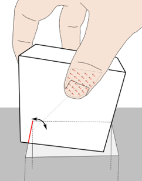

# 2021
* **Dataset in Machine Learning Research** (**DMLR**)
  * title and link: [Reduced, Reused and Recycled: The Life of a Dataset in Machine Learning Research](https://arxiv.org/abs/2112.01716)
  * information: NeurIPS 2021 outstanding datasets and benchmarks paper UCLA Google
  * problem and position: study dataset usage patterns differ across ML communities and across time
  * method overview: use PaperWithCode’s papers and datasets
    * concentrated on few specific datasets and the trend is still increasing
    * like borrowing datasets from other tasks
    * major datasets are contributed by few elite institutions

* **in-hand object Re-orientation** (**Reorientation**)
  * title and link: [A System for General In-Hand Object Re-Orientation](https://arxiv.org/abs/2111.03043)
  * information: CoRL 2021 best paper MIT
  * problem and position: the first general in-hand object re-orientation
  * method overview: model-free RL with teacher-student learning
  * teaser: 
    
  * results: serve as strong baseline
    
  * method details: 
    * teacher policy by PPO with MLP, input states that can get from simulator but not real world, goal set by giving difference with target orientation as also state, output delta robot joints
    * student policy by Dagger distillation with sparse 3D CNN, input hand joint positions and scene point cloud, goal set by giving target object point cloud as also input, output delta robot joints
    * object stable configuration initialization for facing downward: first train an object-lifting policy and use it to collect lifted ending configurations and use them as initialization for reorientation policy training
    * gravity curriculum learning for facing downward: gradually adding gravity
    * one object one individual student policy
    * surprising finding: visual perception can generalize to unseen objects well

* **Controllable Music Transformer** (**CMT**)
  * title and link: [Video Background Music Generation with Controllable Music Transformer](https://arxiv.org/abs/2111.08380)
  * information: ACM MM 2021 best paper Beihang
  * problem and position: video background music generation consistent with video
  * method overview: rhythmic relations between video and music to extract corresponding music attributes, then Transformer generates music from music attributes
  * results: not standard benchmark, self comparison
  * method details: 
    * positive correlation between motion speed and simu-note density
      * motion speed as average optical flow magnitude this clip
    * align local-max motion saliency with simu-note strength
      * motion saliency as average optical flow change this frame
    * music appears and disappears smoothly along with the start and end of video
      * frame number in video corresponds to beat/bar timing
    
    * rhythm-related music attributes: beat/bar, density, strength
    * note-related music attributes: pitch, duration, instrument
    * these attributes as tokens for Transformer
    * training uses only music dataset, music attributes reconstruct music
    * inference uses video, extract music attributes by rhythmic relations and then generate music
    

* **Shifted Windows Transformer** (**SwinTransformer**)
  * title and link: [Swin Transformer: Hierarchical Vision Transformer using Shifted Windows](https://arxiv.org/abs/2103.14030)
  * information: ICCV 2021 best paper MSRA
  * problem and position: general-purpose Transformer backbone for CV tasks
  * method overview: self-attention within local windows for linear computation and shifted windows for global connection and hierarchical for multi-scale
  * teaser: 
    
  * results: 87.3% top-1 acc on ImageNet-1K, 58.7 box AP and 51.1 mask AP on COCO, 53.5 mIoU on ADE20K
  * method details: 
    * 2 challenges
      * visual tokens’ scale varies due to objects’ different size
      * need dense prediction but high resolution causes high computation
    * patch partition: just partition and concatenate RGB values
    * linear embedding: MLP maps $48 \rightarrow C$
    * patch merging: partition and concatenate features and MLP
    
    * W-MSA: self-attention within local windows
    * SW-MSA: still self-attention within local but shifted windows
    * shifted window makes window irregular: cyclic-shifting and mask
    
    

* **Extended Tactile Perception** (**ETP**)
  * title and link: [Extended Tactile Perception: Vibration Sensing through Tools and Grasped Objects](https://arxiv.org/abs/2106.00489)
  * information: IROS 2021 best paper NUS
  * problem and position: the first defining and dealing with the ETP task
  * method overview: vibro-tactile sensor receives vibration signals and MLP to predict contact information
  * teaser: 
    
  * results: not standard benchmark, self comparison
    
  * method details: 
    * ETP estimates contact information between the object and environment using vibro-tactile sensing
    * contact information can be transmitted as vibrations
    * NUSkin: proposed vibro-tactile sensor with higher 4kHz frequency
    * MLP on the input signals and outputs contact information
    * test on tap localization, grasp stability prediction and food identification tasks

* **Persistent Evolution Strategies** (**PES**)
  * title and link: [Unbiased Gradient Estimation in Unrolled Computation Graphs with Persistent Evolution Strategies](https://arxiv.org/abs/2112.13835)
  * information: ICML 2021 outstanding paper Toronto Google
  * problem and position: deal with high variance, bias, slow and large memory problems in parameters optimizing in unrolled computation graphs
  * method overview: actually Truncations ES already solves slow and large memory problems, PES improves based on it by accumulating correction terms over entire sequences of unrolls, *I cannot understand*
    
  * results: 
    

* **ThreeD Autonomous Robot Exploration** (**TARE**)
  * title and link: [TARE: A Hierarchical Framework for Efficiently Exploring Complex 3D Environments](https://roboticsconference.org/2021/program/papers/018/index.html)
  * information: RSS 2021 best paper CMU
  * problem and position: efficient autonomous exploration in complex 3D environment
  * method overview: hierarchical with one level computing detailed path within a local planning horizon and another level computes coarse path at the global scale, *I cannot understand*
  * teaser: 
    
  * results: 
    

* **GeneratIve RAdiance Feature FiElds** (**GIRAFFE**)
  * title and link: [GIRAFFE: Representing Scenes as Compositional Generative Neural Feature Fields](https://arxiv.org/abs/2011.12100)
  * information: CVPR 2021 best paper MPI
  * problem and position: controllable image generation such as poses and composition
  * method overview: incorporate compositional NeRFs for individual objects into GAN
  * teaser: 
    
  * results: 
    
  * method details: 
    * generator like GRAF, sample camera pose $\xi$ to get query ray $(x, d)$, sample latent variables $z_s$ for shape and $z_a$ for appearance to generalize across scenes, but output feature $f$ instead of color $c$
      
    * decompose scene into $N-1$ foreground objects and $1$ background, all share the same neural field, then use different transformation $T$ to compose
      
    * classical 3D volume rendering on feature $f$ instead of color $c$ to low-resolution feature image $I_V \in R^{H_V \times W_V \times M_f}$
    * 2D CNN decodes feature image $I_V$ to RGB image $\hat{I} \in R^{H \times W \times 3}$
    

* **Extrinsic Contact Sensing** (**ECS**)
  * title and link: [Extrinsic Contact Sensing with Relative-Motion Tracking from Distributed Tactile Measurements](https://arxiv.org/abs/2103.08108)
  * information: ICRA 2021 best paper MIT
  * problem and position: the first defining and dealing with the ECS task
  * method overview: distributed tactile sensor measurements estimate object motion and contact prior gives constraints to the motion which can be used to optimize the contacts
  * teaser: 
    
  * results: 
    
  * method details: 
    * ECS estimates the contacts between the object and environment using distributed tactile sensors, ICS estimates the contacts between finger and the object using aggregated force/torque sensor
      
    * motion with prior contact has constraints such as fixed point contact, which can be formed as optimization problem
      
    * motion can be estimated by distributed tactile sensor
      

* **Stochastic Differential Equations** (**SDE**)
  * title and link: [Score-Based Generative Modeling through Stochastic Differential Equations](https://arxiv.org/abs/2011.13456)
  * information: ICLR 2021 outstanding paper Stanford Google
  * problem and position: unified framework for score-based diffusion models
  * method overview: use continuous SDE to describe diffusion process, need SDE solver to do reverse sampling
  * method details: 
    * diffusion process can be written as SDE, with reverse SDE needing score function to be learned
      
    * SMLD and DDPM’s diffusion both can be regarded as discretized SDEs
      
    * Predictor-Corrector sampler: numerical SDE solver first gives an estimate as predictor, then score-based MCMC corrects the marginal distribution of the estimate as corrector
    * SMLD can be regarded as identity predictor and annealed Langevin dynamics corrector, DDPM can be regarded as ancestral sampling predictor and identity corrector
