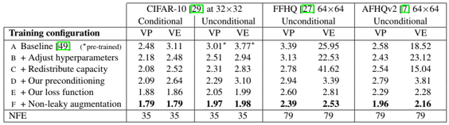
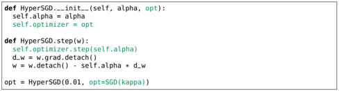
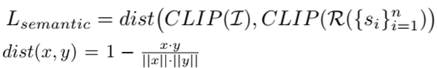
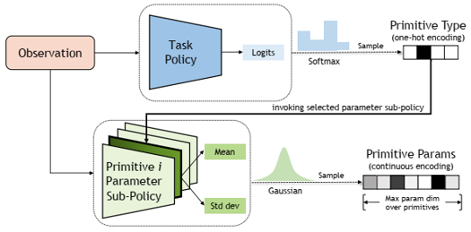
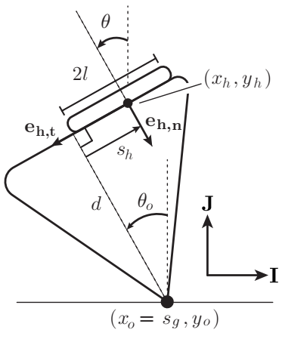

# 2022
* **Learning from Interactive Reward Functions** (**LIRF**)
  * title and link: [Training Robots to Evaluate Robots: Example-Based Interactive Reward Functions for Policy Learning](https://arxiv.org/abs/2212.08961)
  * information: CoRL 2022 best paper
  * problem and position: to act as reward function for RL on robot manipulation, target image is partial but interaction can easily evaluate success
  * method overview: learn interaction policy instead of original image-based classifier as interactive reward function
  * teaser: 
    
  * results: 
    
  * method details: 
    * original exemplar rewards are learned by image-based classifier $D(o)$, which is pre-trained on provided target image examples
    * here examples change to provided target actionable instances
    * here classifier changes to IRF policy $\pi_R$
    * here exemplar reward changes to image-based classifier reward $D(o^*)$ on the image after IRF policy executing $o^T \overset{\pi_R}{\rightarrow} o^*$
    * here IRF policy pre-training changes to maximizing image-based classifier rewards
    * additionally use IRF policy during inference executing, run $\pi_T$ a fixed steps and then run $\pi_R$ to determine whether complete, if not resume $\pi_T$
    

* **do as i Can not as i Say** (**SayCan**)
  * title and link: [Do As I Can, Not As I Say: Grounding Language in Robotic Affordances](https://arxiv.org/abs/2204.01691)
  * information: CoRL 2022 special innovation paper Google (Chelsea Finn, Sergey Levine)
  * problem and position: mobile manipulation given human instruction, LLM can do high-level instruction planning but without specific context
  * method overview: LLM plans high-level autoregressively (task-grounding) and affordance function judges feasible each step under current state (world-grounding)
  * results: over 101 instructions but only in 1 scene, synthetic as 74% success rate, real as 64% success rate
  * method details: 
    * predefined 551 short task skills, trained individually by BC or RL
    * pretrained scoring LLM judges probability $p(l_{\pi} \mid i)$ for different skill description $l_{\pi}$ following the instruction $i$
    * affordance function gives success rate $p(c_{\pi} \mid s, l_{\pi})$, obtained as value function from task skills training
    * select $\argmax_{\pi}⁡ p(l_{\pi} \mid i) p(c_{\pi} \mid s, l_{\pi})$ to execute
    

* **Imagen** (**Imagen**)
  * title and link: [Photorealistic Text-to-Image Diffusion Models with Deep Language Understanding](https://arxiv.org/abs/2205.11487)
  * information: NeurIPS 2022 outstanding paper Google (Jonathan Ho)
  * problem and position: SOTA text2image diffusion model
  * method overview: frozen language model get text embedding and used to condition diffusion model and then super-resolution diffusion model
  * results: SOTA zero-shot FID score of 7.27 on COCO
    
  * method details: 
    * frozen T5-XXL encoder maps text to embedding
    * text embedding as condition on U-Net diffusion model, trained by classifier-free guidance, with dynamic thresholding
    * two super-resolution diffusion models also condition on text embedding, also trained by classifier-free guidance, but with noise conditioning augmentation and noise level conditioning
    
    * additionally, discover insight that large frozen language models trained only on text data are surprisingly very effective text encoders for text-to-image generation (the other type is image-text pair training like CLIP)
    * additionally, discover insight that scaling the size of frozen text encoder improves sample quality significantly more than scaling the size of image diffusion model
    
    * additionally, introduce DrawBench as benchmark

* **Elucidating Diffusion Model** (**EDM**)
  * title and link: [Elucidating the Design Space of Diffusion-Based Generative Models](https://arxiv.org/abs/2206.00364)
  * information: NeurIPS 2022 outstanding paper Nvidia
  * problem and position: unify diffusion model into common framework, decouple into different modules
  * method overview: decouple denoising score matching diffusion model into different components and give best practice
  * results: SOTA FID of 1.79 for CIFAR-10 in class-conditional setting and 1.97 in unconditional setting, sampling also much faster
  * method details: 
    
    
    

* **Procedural The House Of inteRactions** (**ProcTHOR**)
  * title and link: [ProcTHOR: Large-Scale Embodied AI Using Procedural Generation](https://arxiv.org/abs/2206.06994)
  * information: NeurIPS 2022 outstanding paper
  * problem and position: procedurally generate interactive embodied AI environments
  * method overview: procedurally generate large-scale environments
  * teaser: 
    
  * results: models pre-trained on ProcTHOR achieve SOTA across 6 benchmarks
    
    
  * method details: 
    * built upon AI2-THOR
    * properties: simulated, unlimited-number, diverse, interactive
    * additional ProcTHOR-10K: 10000 houses generated using 16 room specifications
    * additional ArchitecTHOR: 10 artist-designed high quality houses as test-only environments
    * simple model as CNN encoding visual information and RNN capturing temporal information to show benefit of large-scale training
    

* **Hyper-Optimizer** (**HyperOptimizer**)
  * title and link: [Gradient Descent: The Ultimate Optimizer](https://arxiv.org/abs/1909.13371)
  * information: NeurIPS 2022 outstanding paper MIT
  * problem and position: automatically differentiate hyperparameters to avoid hyperparameters tuning
  * method overview: Baydin et al. (2018) manually calculate gradients, but we want to apply AD to hyperparameters and easily extend to other optimizers and also easily stack recursively
  * teaser: 
    
  * method details: 
    
    
    
    

* **Chinchilla** (**Chinchilla**)
  * title and link: [Training Compute-Optimal Large Language Models](https://arxiv.org/abs/2203.15556)
  * information: NeurIPS 2022 outstanding paper DeepMind
  * problem and position: empirical analysis on training LLM scale
  * method overview: given a fixed FLOPS/compute budget, model size and number of training tokens should be scaled equally
  * results: Chinchilla as 70B model parameters and 1.4 trillion training tokens, the same compute budget as Gopher (280B), SOTA 67.5% acc on MMLU
  * method details: 
    

* **MineDojo** (**MineDojo**)
  * title and link: [MineDojo: Building Open-Ended Embodied Agents with Internet-Scale Knowledge](https://arxiv.org/abs/2206.08853)
  * information: NeurIPS 2022 outstanding datasets and benchmarks paper Nvidia (Linxi Fan, Yuke Zhu)
  * problem and position: MineCraft benchmark
  * method overview: simulation platform and thousands of defined open-ended tasks and internet-scale multimodal MineCraft knowledge base and pre-training MineCLIP as RL reward also evaluation metric
  * teaser: 
    
  * results: 
    
  * method details: 
    * built upon MineRL
    * properties: unified observation and action spaces across all tasks, include all three worlds
    * 1581 programmatic tasks have determinant success criterion, 1560 creative tasks use MineCLIP
    * knowledge base include YouTube videos with transcripts and MineCraft wiki and Reddit posts
    * PPO RL agent with MineCLIP reward
    * MineCLIP as pre-trained contrastive video-language model by YouTube knowledge base
      

* **Speed Folding** (**SpeedFolding**)
  * title and link: [SpeedFolding: Learning Efficient Bimanual Folding of Garments](https://arxiv.org/abs/2208.10552)
  * information: IROS 2022 best paper UCBerkeley
  * problem and position: bimanual garments folding
  * method overview: pre-defined action primitives and BiMaMa-Net classifies action primitive and outputs action value map
  * teaser: 
    
  * results: 
    
  * method details: 
    * two-stage: first smooth then fold
    * smoothing action primitives: fling, pick-and-place and drag
    * folding action primitives: fold and move
    * classifier head outputs smoothness value to change from smoothing stage to folding stage
    * shared ResNext encoder backbone and then classification head to determine action primitive $m$ and then decoder per action primitive to decode action value $Q(<x_1, y_1, \theta_1>, <x_2, y_2, \theta_2>)$, then select the highest action value to perform $(m, <x_1, y_1, \theta_1>, <x_2, y_2, \theta_2>)$
    * decoder first outputs value map $Q_{unc}$ for single arm and then forms correspondence descriptor $d$ and then samples pair of correspondence descriptors $d_1, d_2$ according to probability of value and then MLP to final value $Q(d_1, d_2)$
      
    

* **Partial Distance Correlation** (**PDC**)
  * title and link: [On the Versatile Uses of Partial Distance Correlation in Deep Learning](https://arxiv.org/abs/2207.09684)
  * information: ECCV 2022 best paper
  * problem and position: study applications for partial distance correlation in deep learning
  * method overview: partial distance correlation as measurement between representations, used for (1) learning multiple networks for mutually independent features by PDC as regularization loss, (2) measuring similarity between networks by calculate PDC between hidden layers, (3) disentangling latent variables for generative model by PDC as regularization loss
    
    
    

* **Search-oriented micro-Video Captioning** (**SVC**)
  * title and link: [Search-oriented Micro-video Captioning](https://dl.acm.org/doi/10.1145/3503161.3548180)
  * information: ACM MM 2022 best paper HIT
  * problem and position: the first search-oriented micro-video captioning
  * method overview: construct search-oriented micro-video captioning dataset, pre-train a multimodal network, use to form a captioning model
  * teaser: 
    
  * results: 
    
    
  * method details: 
    * instead of content-oriented video captioning, we focus on generating query-like captions from consumer perspective
    * golden Kwai-SVC and larger Kwai-SVC-11M: search-oriented micro-video captioning datasets based on Kwai
    * Multimodal prE-training nEtwork based on the Kwai platform (MEEK): 574M parameters trained on Kwai-SVC-11M with 5 tasks
      
    * FLow-based dIverse caPtioning approach (FLIP): CVAE-like
      * Transformer-based encoder and decoder: input visual and textual features extracted by MEEK $V \in R^{D \times M}, T \in R^{D \times N}$ and output hidden states $H^E, H^D \in R^{D \times (M+N)}$
        
      * MLP-based posterior $q_{\phi}(z \mid x, v, t)$: capture diversity by modeling Gaussian distribution $N(z; \mu, \sigma^2)$
      * flow-based prior $p_{\psi}(z \mid v, t)$: transfer diversity from posterior to prior by minimizing KL divergence, using invertible flow transformation from $N(z_0; 0, I)$
        
      * intent-driven generation: input $H^E, H^D$ and condition $z$ and output $x$
      

* **Graphon Mixup** (**G-Mixup**)
  * title and link: [G-Mixup: Graph Data Augmentation for Graph Classification](https://arxiv.org/abs/2202.07179)
  * information: ICML 2022 outstanding paper
  * problem and position: Mixup data augmentation for graph data classification
  * method overview: each class estimate graph generator graphon and mixup graphon
    
    
  * teaser: 
    
  * results: 
    

* **Iterative Residual Policy** (**IRP**)
  * title and link: [Iterative Residual Policy: for Goal-Conditioned Dynamic Manipulation of Deformable Objects](https://arxiv.org/abs/2203.00663)
  * information: RSS 2022 best paper Columbia (Shuran Song)
  * problem and position: goal-conditioned dynamic manipulation of deformable objects
  * method overview: sample delta action and predict resulting trajectory and select the best delta action to execute in the next iteration
  * teaser: 
    
  * results: 
    
  * method details: 
    * given observed trajectory $T_i$ executed by $a_i$ at iteration $i$, sample several possible delta actions $\delta a_i^j$, use network to predict resulting trajectory $\hat{T_i^j}$, select the minimum distance $D(\hat{T_i^j}, g)$ between goal $g$ to execute the next iteration action $a_{i+1} = a_i + \delta a_i^{j^*}$
    * test on 2 tasks: trajectory as observed keypoints' positions, action as robot's position and velocity
      * rope whipping to hit target point
      * cloth swinging to reach target pose
    * trajectory is $N_g \times 256 \times 256$ occupancy image with $[0, 1]$ value, action is broadcasted to $N_a \times 256 \times 256$ action image with the same scaled $[0, 1]$ value inside each channel, concatenate them
    * Delta Dynamics Network uses semantic segmentation model DeepLabV3+
    * training uses simulation, uniformly sample action and Gaussianly sample delta action and target trajectory can be simulated
    * initial action as the best average action in training datasets
    * delta action is sampled from $N(0, (0.5 \times D(T_i, g))^2)$
    * argue and experimentally validate that residual is better to learn
    

* **CLIP Picasso** (**CLIPasso**)
  * title and link: [CLIPasso: Semantically-Aware Object Sketching](https://arxiv.org/abs/2202.05822)
  * information: SIGGRAPH 2022 best paper
  * problem and position: converts an image of an object to a sketch, allowing for varying levels of abstraction
  * method overview: define sketch as Bezier curves and define loss between sketch and image using CLIP to backpropagate to optimize curve parameters
  * teaser: 
    
  * results: 
    
    
  * method details: 
    * define sketch as a set of $n$ Bezier curves with 4 control points $s_i = \{p_i^j\}_{j=1}^4 = \{(x_i, y_i)^j\}_{j=1}^4$ and use differentiable rasterizer to render
    * calculate loss between sketch and original image, backpropagate to control points $s_i$
      
      
      
    * control points are initialized using salient regions, produced by multiplying edge map by XDOG and relevancy map by CLIP
    * each image to sketch needs an optimization procedure, not a end-to-end model directly outputting sketch
    

* **Instant Neural Graphics Primitives** (**instant-ngp**)
  * title and link: [Instant Neural Graphics Primitives with a Multiresolution Hash Encoding](https://arxiv.org/abs/2201.05989)
  * information: SIGGRAPH 2022 best paper Nvidia
  * problem and position: deal with encoding MLP coordinate input to improve MLP performance and training speed like in NeRF
  * method overview: learnable multiresolution hash table with CUDA implementation
  * results: 
    
    
  * method details: 
    * $L$ layers of learnable multiresolution hash table $\theta_l$, each has size $T$, each element has feature dimension $F$
      
    * coarser resolution's mapping from grid corner to table item is 1-1, but finer resolution may exceed $T$ so need hashing, but no explicit collision handling, instead relying on neural network's magic
      
    * implement in CUDA, test across Gigapixel, SDF, NRC and NeRF
    

* **Learning Multi-View Geometry** (**LearningMVG**)
  * title and link: [Learning to Solve Hard Minimal Problems](https://arxiv.org/abs/2112.03424)
  * information: CVPR 2022 best paper
  * problem and position: learning-based method solving multi-view geometry problem
  * method overview: MLP predict an initial $(p_0, s_0)$ and then HC, instead of multiple HCs and then select
  * teaser: 
    
  * results: accuracy decreases but speed up
    
  * method details: 
    * directly solving equations have multiple solutions and many are spurious solutions, we do not want solve them all and then select the right ones, instead we pick an initial anchor and gradually change to the right
      
    * problem-solution manifold $M : P \times S$
      * problem: $p \in R^{20}$: 5 pts in 2 image-views
      * solution: $s \in R^9$: 10-1=9 unknown point depths
      * probability density: $\mu$: distribution of real-world $(p, s)$ pairs
      * projection: $\pi : M \rightarrow P$
      
    * offline stage
      * sample dataset $D$ to represent $M$ and $\mu$
      * select anchors $A \subseteq D$ so that high fraction of $(p, s)$ from $M_{\mu}$ can be tracked by HC
        
      * train MLP selector/classifier $\sigma(p) = a \in A$
        
    * online stage
      * select anchor $a = (p_0, s_0) = \sigma(p)$
      * Homotopy Continuation from $(p_0, s_0) \rightarrow (p, s)$
    * actually not restrict to multi-view geometry problem, can be extended to any equations solving problem

* **Image into Bird’s-Eye-View** (**Image2BEV**)
  * title and link: [Translating Images into Maps](https://arxiv.org/abs/2110.00966)
  * information: ICRA 2022 outstanding paper
  * problem and position: instantaneous mapping that convert image to BEV
  * method overview: Transformer on vertical scanline in image plane to correspond to polar ray in BEV
  * results: 
    
    
  * method details: 
    * insight: 1-1 correspondence between vertical scanline in image plane and polar ray in BEV -> seq2seq translation problem
    * CNN extracts multi-scale features $f_{t, s}^I \in R^{C \times h_s \times w_s}$
    * each scale owns individual Transformer encoder, with input sequence as each column in $f_{t, s}^I$, $w_s$ sequences, each sequence has length $h_s$, dimension $C$, produce memory $h_{t, s}^I \in R^{w_s \times h_s \times C}$, only attention among each column
    * each scale owns individual Transformer decoder, with input sequence as each column in $h_{t, s}^I$, $w_s$ sequences, each sequence has length $h_s$, dimension $C$, produce polar encoding $f_{t, s}^{BEV} \in R^{w_s \times r_s \times C}$, only attention among each column
    * each scale $f_{t, s}^{BEV}$ corresponds to specific radius range, concat to convert into regular grid $f_t^{BEV} \in R^{C \times Z \times X}$
    * optional dynamics module incorporates temporal information by attention across timesteps
    * segmentation module inputs $f_t^{BEV} \in R^{C \times Z \times X}$ and outputs segmentation mask $m_t^{BEV} \in R^{Class \times Z \times X}$
    
    
    

* **MAnipulation Primitive-augmented reinforcement LEarning** (**MAPLE**)
  * title and link: [Augmenting Reinforcement Learning with Behavior Primitives for Diverse Manipulation Tasks](https://arxiv.org/abs/2110.03655)
  * information: ICRA 2022 outstanding learning paper (Yuke Zhu)
  * problem and position: augment RL for manipulation with pre-defined behavior primitives
  * method overview: augment RL action space with pre-defined behavior primitives
  * results: 
    
  * method details: 
    * pre-defined behavior primitives include reaching, grasping, pushing
    * augment RL’s original robot control action space with behavior primitives
    * a high-level task policy network $\pi_{tsk}$ determines which primitive $a$
    * a collection of low-level parameter policy networks $\pi_{p}$ determines how primitive parameters $x$
    * add manually defined affordance for each behavior primitive to reward function
    
    

* **Contact Configuration** (**ContactConfig**)
  * title and link: [Manipulation of unknown objects via contact configuration regulation](https://arxiv.org/abs/2203.01203)
  * information: ICRA 2022 outstanding manipulation paper MIT
  * problem and position: manipulate unknown object by regulation of contact configuration
  * method overview: mathematically model and then estimate unknown values and then use them to control
  * teaser: 
    
  * method details: 
    * mathematically model: robot hand $(x_h, y_h, \theta_h) (f_h, \tau_h, \mu_h)$, object $(x_o, y_o, \theta_o)$ and ground
      
    * wrench constraint and contact mode/geometry estimator: use $\{f_h, \tau_h\}_t$ to estimate contact constraint cones and use cones to estimate contact mode
      
      
    * kinematic estimator: use $\{f_h, \tau_h, x_h, y_h, \theta_h\}_t$ to estimate $d, x_o, y_o, s_h$
    * low-level impedance control to apply $f_h, \tau_h$

* **Analytic-DiffusionProbilityModel** (**Analytic-DPM**)
  * title and link: [Analytic-DPM: an Analytic Estimate of the Optimal Reverse Variance in Diffusion Probabilistic Models](https://arxiv.org/abs/2201.06503)
  * information: ICLR 2022 outstanding paper Tsinghua (Jun Zhu, Bo Zhang)
  * problem and position: derive some theoretic analyses for diffusion model and apply to practice
  * method overview: derive theoretic optimal value for original hand-craft variance and its theoretic bound to clip estimated value and also theoretic optimal KL divergence for optimal trajectory
  * results: improve quality and also speed up
  * method details: 
    * derive theoretic optimal value for original non-reweighted loss
      
      * $\mu$ is consistent with original reweighted loss, as score-based model estimating score function $s_n(x_n) = \nabla_{x_n} \log q_n(x_n)$
      * $\sigma$ can be also estimated by using the score-based model by Monte Carlo sampling $\Gamma_n = \frac{1}{M} \sum_{m=1}^M \frac{\|s_n(x_{n, m})\|}{d}, x_{n, m} \sim q_n(x_n)$, instead of original hand-craft
      * also derive theoretic bound for $\sigma$, which can be used to clip the estimated value
        
    * least-cost-path problem (solved by denamic programming) formulation for optimal trajectory instead of full $1, \ldots, N$
      

* **Differentiable Stride** (**DiffStride**)
  * title and link: [Learning strides in convolutional neural networks](https://arxiv.org/abs/2202.01653)
  * information: ICLR 2022 outstanding paper Google
  * problem and position: automatically differentiate convolution stride to avoid tuning
  * method overview: cast downsampling in spatial domain as cropping in frequency domain and learn the cropping box size
  * results: 
    
    
  * method details: 
    * replace strided convolutions by no-stride convolutions followed by DiffStride
    * Spectral Pooling formulates pooling as $\tilde{x} = F^{-1}(crop(F(x)))$ but with fixed cropping box size hyperparameter
    * make differentiable by using mask parameterized by strides
      
      
    * can also derive regularization loss to improve compute efficiency, since the bigger strides then the smaller next layer
      
    
