# 2023
* **Watermark for Large Language Models** (**LLMWatermark**)
  * title and link: [A Watermark for Large Language Models](https://arxiv.org/abs/2301.10226)
  * information: ICML 2023 outstanding paper
  * problem and position: watermark for LLM generated texts
  * method overview: partition tokens into green and red lists when generating texts and detect by computing violation statistics
  * teaser: 
    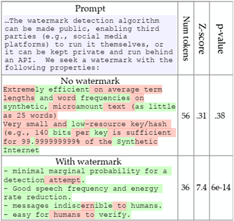
  * method details: 
    * watermark properties
      * without knowledge of LLM
      * do not need re-training
      * detection only needs a contiguous portion of the generated text
      * cannot remove unless modifying a significant portion
    * Algorithm 1: natural half violation but watermarked no, bad for low-entropy
      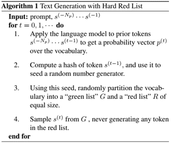
    * Algorithm 2: soft, detect by computing z-statistic
      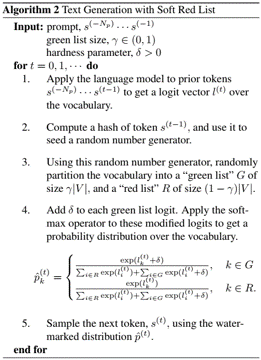

* **D-Adaptation** (**D-Adaptation**)
  * title and link: [Learning-Rate-Free Learning by D-Adaptation](https://arxiv.org/abs/2301.07733)
  * information: ICML 2023 outstanding paper FAIR
  * problem and position: the first automatically setting the learning rate during learning with still optimal convergence rate
  * method overview: estimate D lower bound and apply AdaGrad-like optimization
  * results: 
    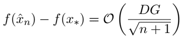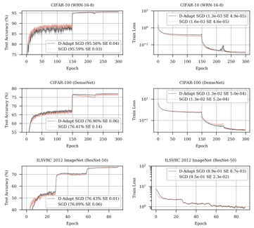
  * method details: 
    * optimal learning rate needs $D$ and $G$
      * $G$ can be achieved by AdaGrad
      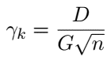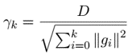
    * construct lower bound $d_k$ on $D=\|x_0 - x_*\|$
      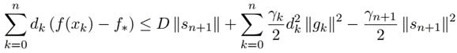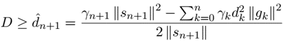
    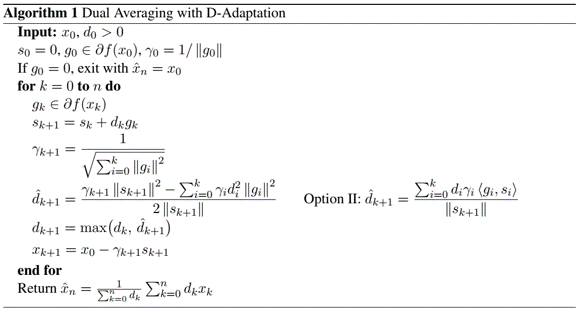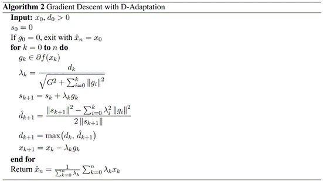

* **3D Gaussian Splatting** (**3DGaussianSplatting**)
  * title and link: [3D Gaussian Splatting for Real-Time Radiance Field Rendering](https://repo-sam.inria.fr/fungraph/3d-gaussian-splatting/3d_gaussian_splatting_low.pdf)
  * information: SIGGRAPH 2023 best paper
  * problem and position: the first real-time rendering of NeRF with still high visual quality
  * method overview: 3D Gaussian as scene representation and optimization interleaved with adaptive density control and tile-based rasterizer
  * results: 
    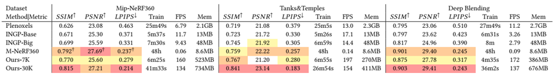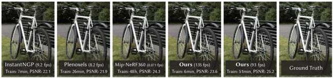
  * method details: 
    * 3D Gaussians with mean point $\mu$ and covariance matrix $\Sigma$, initialized with the sparse point cloud produced by SfM, and can be projected to 2D
    * optimize position $\mu$, covariance $\Sigma$, opacity $\alpha$, spherical harmonic (SH) coefficients
    * Gaussians can be bad for under-reconstruction and over-reconstruction cases, detected by large positional gradients, addressed by adaptive control either clone or split
    * rendering like rasterization, Gaussian as primitive
    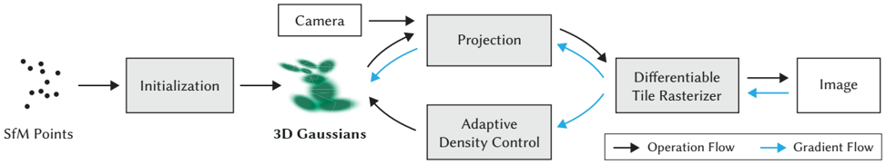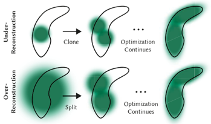

* **Regularize Winding-Number** (**RWN**)
  * title and link: [Globally Consistent Normal Orientation for Point Clouds by Regularizing the Winding-Number Field](https://arxiv.org/abs/2304.11605)
  * information: SIGGRAPH 2023 best paper
  * problem and position: estimate normals of point cloud with globally consistent orientation
  * method overview: use winding number requirements for surface to optimize normals
  * teaser: 
    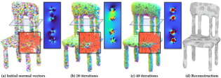
  * results: 
    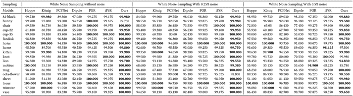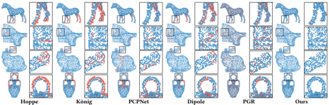
  * method details: 
    * winding number: 1 as interior and 0 as exterior
      * random normals then tend to be 0 everywhere
      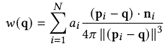
    * 3 requirements lead to optimization objective function
      * winding number is either 0 or 1 at any query points: $f_{01}(n)$
        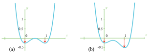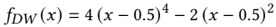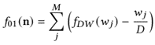
      * 0 1 occurrences are balanced among Voronoi vertices: $f_B(n)$
        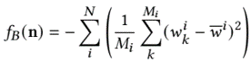
      * normals align with the outside Voronoi poles: $f_A(n)$
        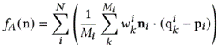
      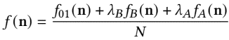

* **Unified Autonomous Driving** (**UniAD**)
  * title and link: [Planning-oriented Autonomous Driving](https://arxiv.org/abs/2212.10156)
  * information: CVPR 2023 best paper Shanghai AI Lab
  * problem and position: the first unify full-stack driving tasks into one end-to-end network for ultimately planning
  * method overview: end-to-end BEVFormer-TrackFormer-MapFormer-MotionFormer-OccFormer-Planner framework connected by queries
  * teaser: 
    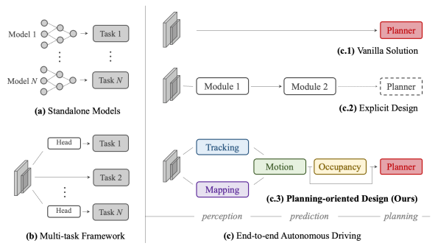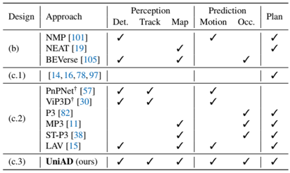
  * results: 
    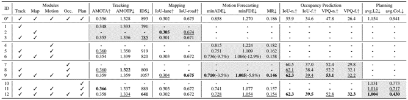
  * method details: 
    * BEVFormer: feature extractor backbone by BEVFormer
    * TrackFormer: detect and track agents by DETR and MOTR
    * MapFormer: panoptic segmentation by Panoptic SegFormer
    * MotionFormer: forecast per-agent future top-k trajectories
    * OccFormer: predict multi-step future occupancy
    * Planner: plan action
    * perception train and then end-to-end train, only care planning performance
    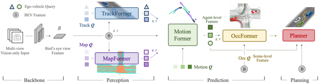

* **Visual Programming** (**VisProg**)
  * title and link: [Visual Programming: Compositional visual reasoning without training](https://arxiv.org/abs/2211.11559)
  * information: CVPR 2023 best paper
  * problem and position: neuro-symbolic approach for compositional visual tasks given natural language instructions
  * method overview: LLM generates high-level programs according to instructions and invokes subroutines to execute on the images
  * method details: 
    * in-context learning of LLM: prompt GPT-3 with pairs of natural language instructions and desired high-level programs, avoid task-specific training, generate high-level python-like modular program
    * subroutines are predefined and invoked step-by-step
    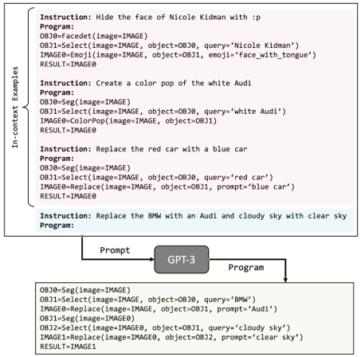

* **Distributed Data-Driven Predictive Control** (**DistributedDDPC**)
  * title and link: [Distributed Data-Driven Predictive Control for Multi-Agent Collaborative Legged Locomotion](https://arxiv.org/abs/2211.06917)
  * information: ICRA 2023 outstanding paper
  * problem and position: computational efficient planner for complex multi-agent collaborative legged locomotion
  * method overview: distributed data-driven predictive control, *I cannot understand*
  * teaser: 
    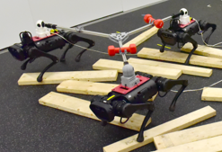

* **Code as Policies** (**CaP**)
  * title and link: [Code as Policies: Language Model Programs for Embodied Control](https://arxiv.org/abs/2209.07753)
  * information: ICRA 2023 outstanding robot learning paper Google
  * problem and position: LLM writes robot policy code given natural language instruction
  * method overview: perception APIs and some predefined subtask APIs are provided
    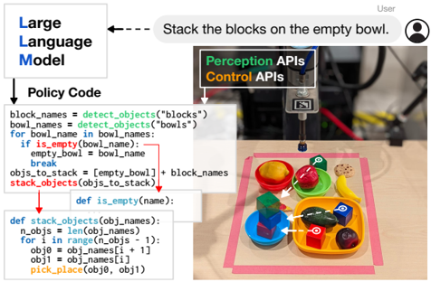

* **Time Optimal Ergodic Search** (**TOES**)
  * title and link: [Time Optimal Ergodic Search](https://arxiv.org/abs/2305.11643)
  * information: RSS 2023 best paper
  * problem and position: ergodic search with minimum time needed
  * method overview: optimization on time with ergodic inequality constraint, *I cannot understand*

* **Visual Token Matching** (**VTM**)
  * title and link: [Universal Few-shot Learning of Dense Prediction Tasks with Visual Token Matching](https://arxiv.org/abs/2303.14969)
  * information: ICLR 2023 outstanding paper
  * problem and position: the first unified few-shot learner for arbitrary dense prediction tasks
  * method overview: image patch similarity as weight to sum label embeddings
  * results: 
    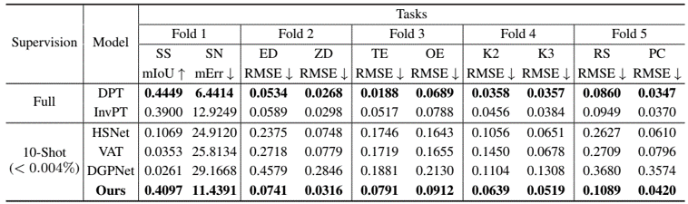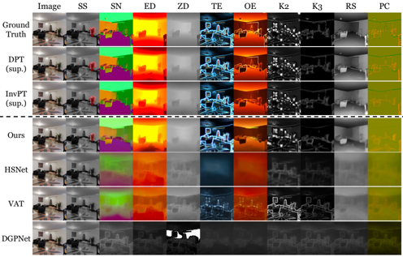
  * method details: 
    * episodic training on several tasks and test on unseen tasks
    * unseen tasks have different output structures: decompose $R^{H\times W\times 3} \rightarrow R^{H\times W\times C_T}$ into $C_T$ independent $R^{H\times W\times 3} \rightarrow R^{H\times W\times 1}$ and learn by shared model
    * query label as weighted combination of support labels in the context of embedding space
      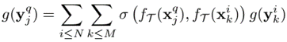
    * image encoder as ViT, initialized by pretrained BEiT
    * label encoder as ViT but from scratch
    * similarity function is implemented as scaled dot-product attention
    * label decoder as Dense Prediction Transformer but from scratch
    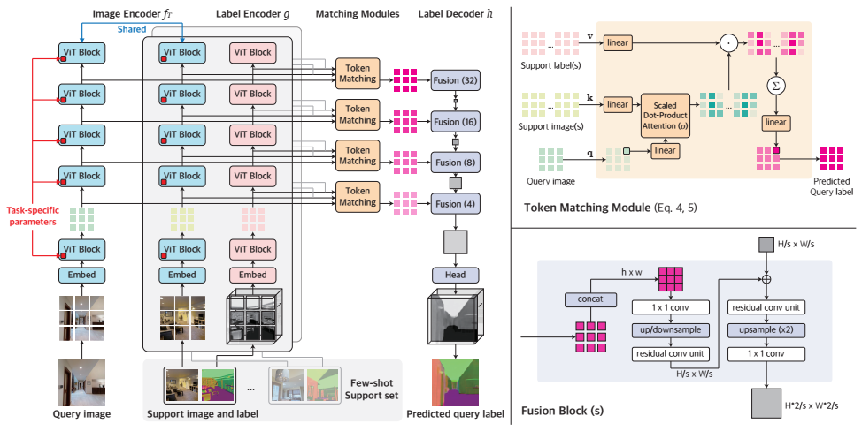

* **Dream Fusion** (**DreamFusion**)
  * title and link: [DreamFusion: Text-to-3D using 2D Diffusion](https://arxiv.org/abs/2209.14988)
  * information: ICLR 2023 outstanding paper Google (Ajay Jain, Jonathan T. Barron, Ben Mildenhall)
  * problem and position: transfer pretrained 2D text2image diffusion models to 3D object synthesis, without any 3D training data
  * method overview: propose a loss for updating NeRF weights to approximate text2image diffusion model generated image distribution
  * teaser: 
    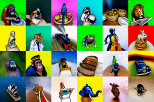
  * method details: 
    * Score Distillation Sampling (SDS): use KL divergence loss to update NeRF parameters $\theta$ so that generating $x = g(\theta)$ approximates sampling from the distribution modeled by diffusion model
      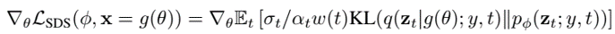
    * diffusion model as Imagen with pretrained weights and frozen
    * NeRF as mip-NeRF 360 modified for additional shading, initialized with random weights and rendered under random camera and light
    * diffusion model can be thought as a teacher model to NeRF
    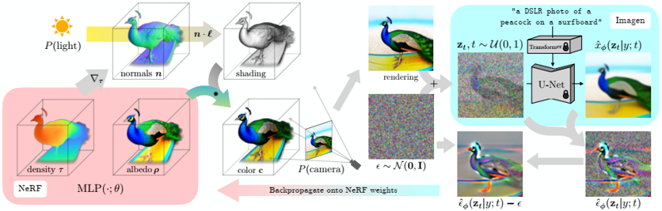

* **Misspecification in Inverse Reinforcement Learning** (**MisspecificationIRL**)
  * title and link: [Misspecification in Inverse Reinforcement Learning](https://arxiv.org/abs/2212.03201)
  * information: AAAI 2023 outstanding paper Oxford
  * problem and position: theoretical analysis on robustness of inverse reinforcement learning to misspecification
  * method overview: *I cannot understand*
