# 2023
* **Emergent Abilities as a Mirage** (**EAM**)
  * title and link: [Are Emergent Abilities of Large Language Models a Mirage?](https://arxiv.org/abs/2304.15004)
  * information: NeurIPS 2023 outstanding paper Stanford
  * problem and position: analysis on the emergent abilities of LLMs
  * method overview: simple theoretical derivation using neural scaling laws and empirical experiments using different metrics
  * results: researcher choosing a metric that nonlinearly or discontinuously deforms per-token rates causes seemingly the emergent abilities, rather than fundamental changes in model behavior with scale
    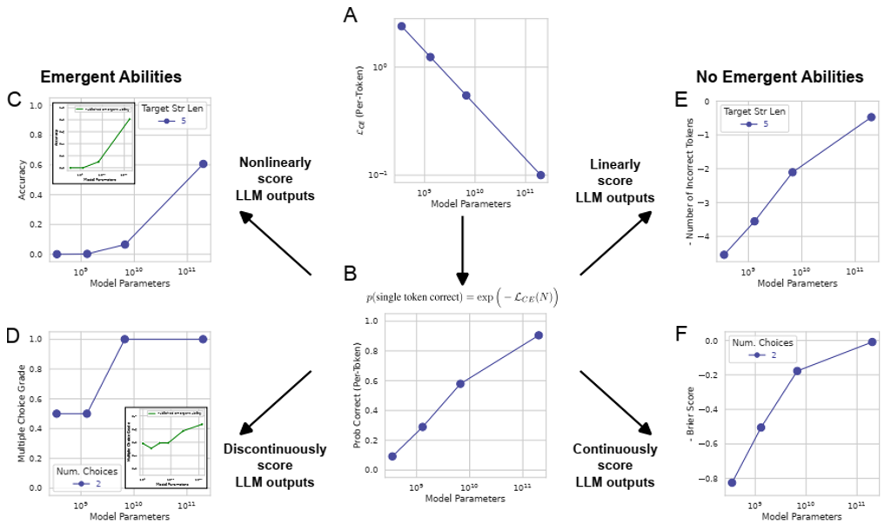

* **Combinatorial-dependence Audio-queried TransformeR** (**CATR**)
  * title and link: [CATR: Combinatorial-Dependence Audio-Queried Transformer for Audio-Visual Video Segmentation](https://arxiv.org/abs/2309.09709)
  * information: ACM MM 2023 best paper ZJU
  * problem and position: deal with Audio-Visual Video Segmentation (AVVS)’s 2 limitations
  * method overview: combinatorial-dependence fusion with decoupled audio-visual transformer encoding and block-wise encoded gate, and object-aware audio-queried decoding
  * teaser: 
    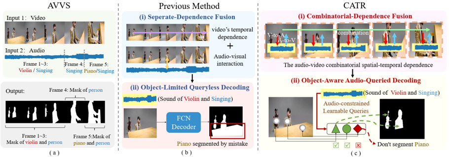
  * results: 
    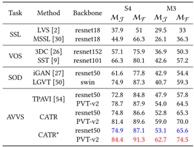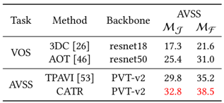
    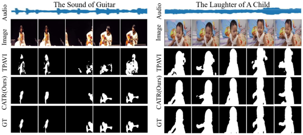
  * method details: 
    * Decoupled Audio-Visual Transformer (DAVT) encoding
      * visual and audio features separately: $F_v^l \in R^{T\times H\times W\times C}$ and $F_a^l \in R^{T\times d}$
      * first visual extraction by ResNet-50 or PVT-v2 and atrous spatial pyramid pooling, first audio extraction by VGGish pretrained on AudioSet
      * then spatial fusion by concatenating audio and visual features and self-attention on the mixed feature as $(H \times W + 1) \times D$
      * then temporal A-V and V-A fusion by multi-head attention alternating KQV as audio and visual features, merge by addition and only visual features are used for decoding
        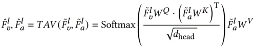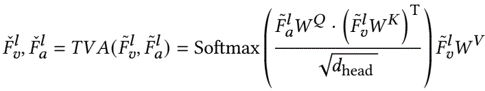
      * but spatial audio-visual fusion already mixes audio and visual features, why additional temporal fusions?
      * and inserted blockwise-encoded gate to propagate weighted features across different blocks
        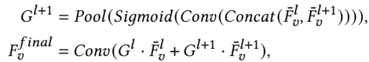
    * Audio-Queried Decoding
      * $N$ learnable queries $Q \in R^{N\times T\times C}$, embedding with audio features
      * visual features by FPN as $F_{seg} \in R^{T \times H/8 \times W/8 \times C}$
      * dynamic kernel generates segmentation $M \in R^{T \times N \times H/8 \times W/8}$
    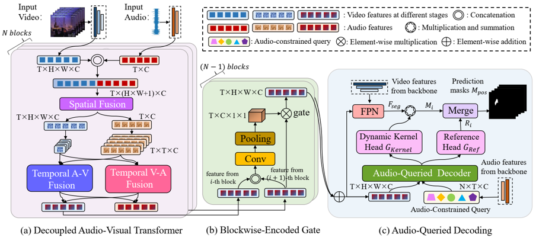

* **Feature Fields for Robotic Manipulation** (**F3RM**)
  * title and link: [Distilled Feature Fields Enable Few-Shot Language-Guided Manipulation](https://arxiv.org/abs/2308.07931)
  * information: CoRL 2023 best paper MIT
  * problem and position: few-shot and language-guided and open-ended grasping
  * method overview: NeRF learns CLIP features from 2D to 3D, use these features to find similar grasp poses from demonstrations or languages
  * teaser: 
    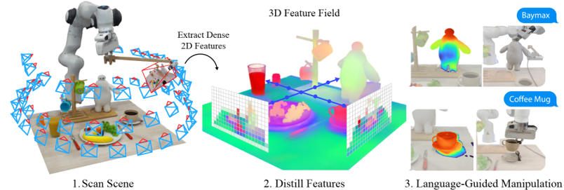
  * results: 
    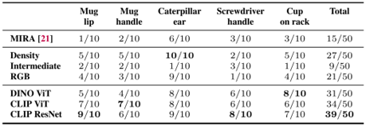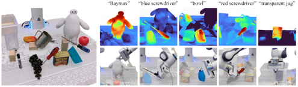
  * method details: 
    * Distilled Feature Fields modify NeRF by additional feature output $f_{vis}$, supervised by 2D feature from patch-level MaskCLIP, each task instance train individually
    * demonstrations/dataset include the target grasp pose $T$, represent the target grasp pose as the average feature of sampled points around the grasp pose $Z_M$, each task category owns one
    * when inference for a new task instance, grasp pose is selected by choosing the discrete voxel having the feature $f_{\alpha}(v)$ most cosine similarity with $Z_M$ of the task category as translation, rotation by optimizing sampled rotations to minimize $z_T$ cos similarity with $Z_M$
    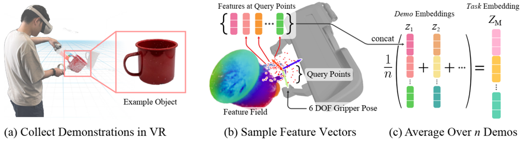
    * for language-guided, the new task instance can have novel but similar object beyond the task category
    * when inference for language-guided, first retrieve demonstrations $z_i$ similar to the query text embedding $q$, then grasp pose is selected by choosing the discrete voxel having the feature $f_{\alpha}(v)$ most cosine similarity with $q$ as translation, rotation by optimizing sampled rotations to minimize $z_T$ cos similarity with $Z_M$ and also $z_i$
    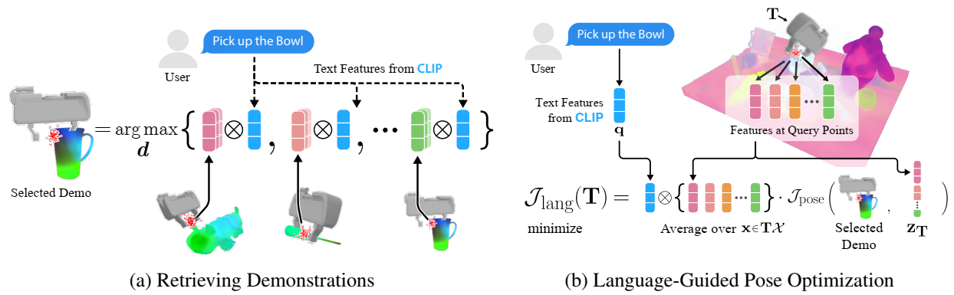

* **RoboCook** (**RoboCook**)
  * title and link: [RoboCook: Long-Horizon Elasto-Plastic Object Manipulation with Diverse Tools](https://arxiv.org/abs/2306.14447)
  * information: CoRL 2023 best systems paper Stanford (Huazhe Xu, Jiajun Wu)
  * problem and position: robot uses tools to manipulate deformable object like making dumplings and alphabet letter cookies
  * method overview: a little bit trivial, GNN models point cloud dynamics model, PointNet++ predicts tool selection and policy action and closed-loop control
  * teaser: 
    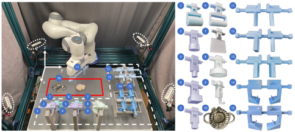
  * results: not standard benchmark, self comparison
  * method details: 
    * perception
      * merge RGBD point clouds from 4 cameras and crop the region of interest
      * color segmentation to extract dough points
      * surface reconstruction to a watertight mesh
      * use reconstructed mesh’s SDF to sample dough inner points
      * use tool’s gt mesh to sample tool surface points
    * dynamics model
      * GNN predicts future states of points based on the current states and action
      * vertex as point with its position and attribute
    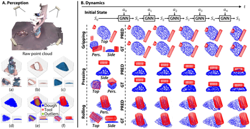
    * closed-loop control
      * PointNet++ based tool classification
      * PointNet++ based policy network, dataset synthesized by GNN dynamics model
      * closed-loop control with visual feedback
    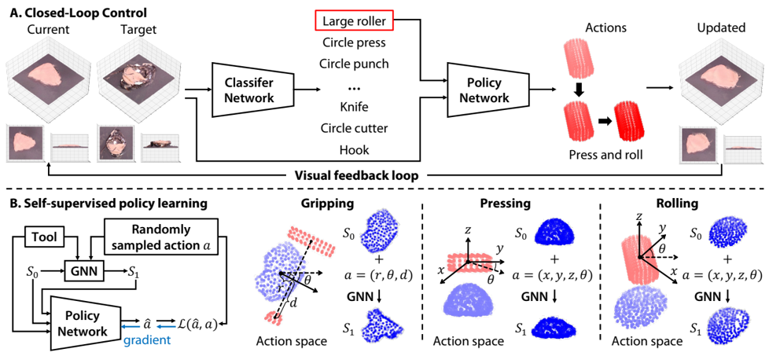

* **Power Line Inspection with Drones** (**PLIDrones**)
  * title and link: [Autonomous Power Line Inspection with Drones via Perception-Aware MPC](https://arxiv.org/abs/2304.00959)
  * information: IROS 2023 best paper
  * problem and position: autonomous power line inspection with drones
  * method overview: MPC with two objectives, one as power line tracking using YOLO and the other as obstacle detection using U-V Disparity Maps
  * teaser: 
    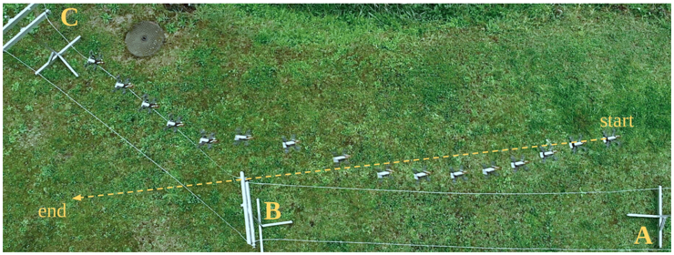
  * results: 
    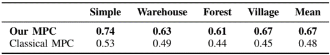

* **ControlNet** (**ControlNet**)
  * title and link: [Adding Conditional Control to Text-to-Image Diffusion Models](https://arxiv.org/abs/2302.05543)
  * information: ICCV 2023 best paper Stanford
  * problem and position: add spatial conditioning controls to pretrained text2image diffusion models
  * method overview: additional branch initialized with zeros finetuning
  * teaser: 
    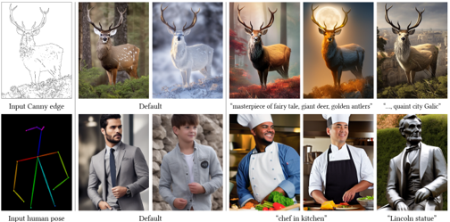
  * results: 
    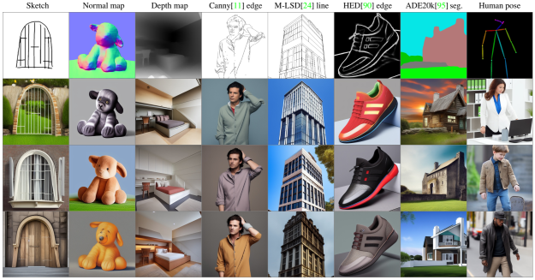
    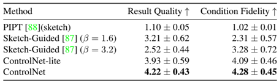
    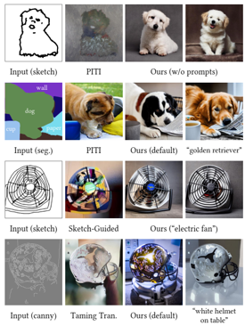
  * method details: 
    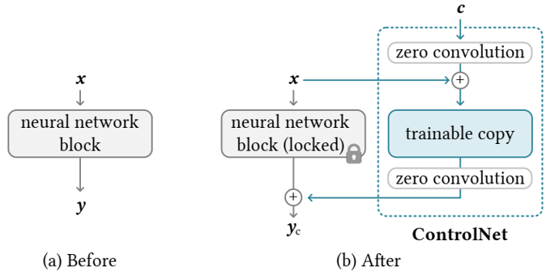
    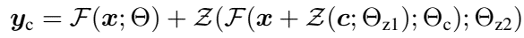
    * experiment on Stable Diffusion
    * since Stable Diffusion works on $64 \times 64$ latent domain, so also convert condition $c$ into $64 \times 64$ size by a tiny network
      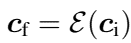
    * during finetuning, randomly 50% remove text prompt to improve semantics ability on conditions
    * finding: sudden convergence phenomenon
      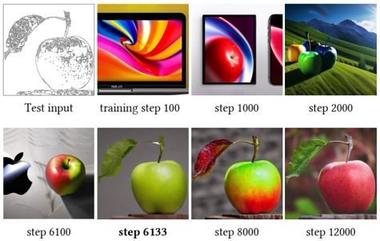

* **Watermark for Large Language Models** (**LLMWatermark**)
  * title and link: [A Watermark for Large Language Models](https://arxiv.org/abs/2301.10226)
  * information: ICML 2023 outstanding paper
  * problem and position: watermark for LLM generated texts
  * method overview: partition tokens into green and red lists when generating texts and detect by computing violation statistics
  * teaser: 
    
  * method details: 
    * watermark properties
      * without knowledge of LLM
      * do not need re-training
      * detection only needs a contiguous portion of the generated text
      * cannot remove unless modifying a significant portion
    * Algorithm 1: natural half violation but watermarked no, bad for low-entropy
      
    * Algorithm 2: soft, detect by computing z-statistic
      

* **D-Adaptation** (**D-Adaptation**)
  * title and link: [Learning-Rate-Free Learning by D-Adaptation](https://arxiv.org/abs/2301.07733)
  * information: ICML 2023 outstanding paper FAIR
  * problem and position: the first automatically setting the learning rate during learning with still optimal convergence rate
  * method overview: estimate D lower bound and apply AdaGrad-like optimization
  * results: 
    
  * method details: 
    * optimal learning rate needs $D$ and $G$
      * $G$ can be achieved by AdaGrad
      
    * construct lower bound $d_k$ on $D=\|x_0 - x_*\|$
      
    

* **Time Optimal Ergodic Search** (**TOES**)
  * title and link: [Time Optimal Ergodic Search](https://arxiv.org/abs/2305.11643)
  * information: RSS 2023 best paper
  * problem and position: ergodic search with minimum time needed
  * method overview: optimization on time with ergodic inequality constraint, *I cannot understand*

* **FurnitureBench** (**FurnitureBench**)
  * title and link: [FurnitureBench: Reproducible Real-World Benchmark for Long-Horizon Complex Manipulation](https://arxiv.org/abs/2305.12821)
  * information: RSS 2023 best system paper KAIST
  * problem and position: real-world furniture assembly benchmark
  * method overview: common setup, reproducible furniture models, easy-to-use robot control software, large teleoperation demonstration dataset, simulated environment
  * teaser: 
    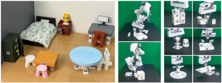
  * results: BC and RL perform bad
    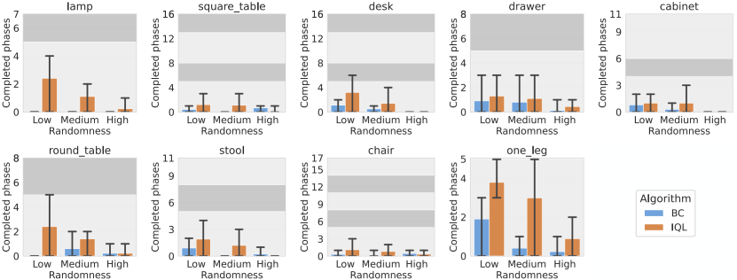
  * method details: 
    * furniture assembly is long-horizon and complex, unlike pick-and-place
      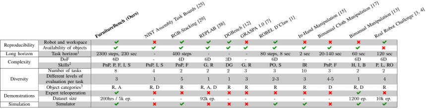
    * common system setup and 8 reproducible 3D printed furniture models
      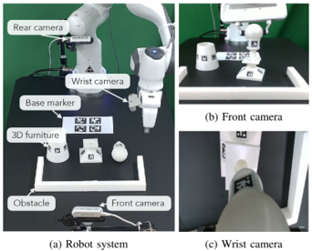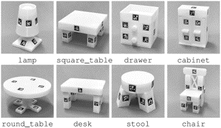
    * observation includes RGB images by front camera and wrist camera and proprioceptive robot states
    * easy-to-use robot control software by python and docker
    * 5100 overall 219.6 hours VR teleoperation demonstration dataset
      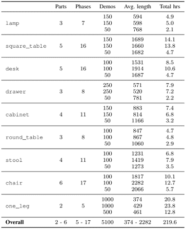
    * FurnitureSim: built upon IssacGym and Factory
      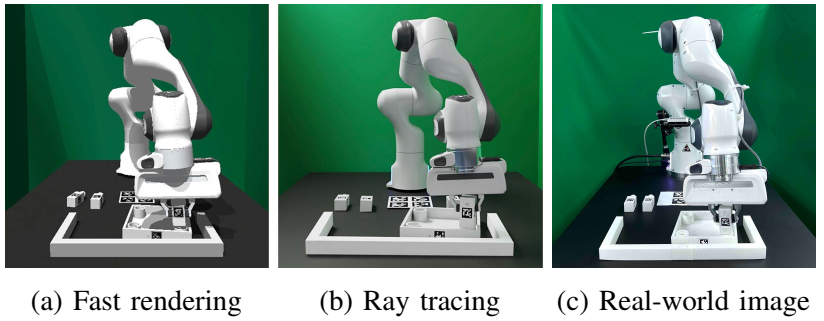
    * evaluate BC with ResNet-18 encoder and IQL with R3M features

* **3D Gaussian Splatting** (**3DGaussianSplatting**)
  * title and link: [3D Gaussian Splatting for Real-Time Radiance Field Rendering](https://repo-sam.inria.fr/fungraph/3d-gaussian-splatting/3d_gaussian_splatting_low.pdf)
  * information: SIGGRAPH 2023 best paper
  * problem and position: the first real-time rendering of NeRF with still high visual quality
  * method overview: 3D Gaussian as scene representation and optimization interleaved with adaptive density control and tile-based rasterizer
  * results: 
    
  * method details: 
    * 3D Gaussians with mean point $\mu$ and covariance matrix $\Sigma$, initialized with the sparse point cloud produced by SfM, and can be projected to 2D
    * optimize position $\mu$, covariance $\Sigma$, opacity $\alpha$, spherical harmonic (SH) coefficients
    * Gaussians can be bad for under-reconstruction and over-reconstruction cases, detected by large positional gradients, addressed by adaptive control either clone or split
    * rendering like rasterization, Gaussian as primitive
    

* **Regularize Winding-Number** (**RWN**)
  * title and link: [Globally Consistent Normal Orientation for Point Clouds by Regularizing the Winding-Number Field](https://arxiv.org/abs/2304.11605)
  * information: SIGGRAPH 2023 best paper
  * problem and position: estimate normals of point cloud with globally consistent orientation
  * method overview: use winding number requirements for surface to optimize normals
  * teaser: 
    
  * results: 
    
  * method details: 
    * winding number: 1 as interior and 0 as exterior
      * random normals then tend to be 0 everywhere
      
    * 3 requirements lead to optimization objective function
      * winding number is either 0 or 1 at any query points: $f_{01}(n)$
        
      * 0 1 occurrences are balanced among Voronoi vertices: $f_B(n)$
        
      * normals align with the outside Voronoi poles: $f_A(n)$
        
      

* **Unified Autonomous Driving** (**UniAD**)
  * title and link: [Planning-oriented Autonomous Driving](https://arxiv.org/abs/2212.10156)
  * information: CVPR 2023 best paper Shanghai AI Lab
  * problem and position: the first unify full-stack driving tasks into one end-to-end network for ultimately planning
  * method overview: end-to-end BEVFormer-TrackFormer-MapFormer-MotionFormer-OccFormer-Planner framework connected by queries
  * teaser: 
    
  * results: 
    
  * method details: 
    * BEVFormer: feature extractor backbone by BEVFormer
    * TrackFormer: detect and track agents by DETR and MOTR
    * MapFormer: panoptic segmentation by Panoptic SegFormer
    * MotionFormer: forecast per-agent future top-k trajectories
    * OccFormer: predict multi-step future occupancy
    * Planner: plan action
    * perception train and then end-to-end train, only care planning performance
    

* **Visual Programming** (**VisProg**)
  * title and link: [Visual Programming: Compositional visual reasoning without training](https://arxiv.org/abs/2211.11559)
  * information: CVPR 2023 best paper
  * problem and position: neuro-symbolic approach for compositional visual tasks given natural language instructions
  * method overview: LLM generates high-level programs according to instructions and invokes subroutines to execute on the images
  * method details: 
    * in-context learning of LLM: prompt GPT-3 with pairs of natural language instructions and desired high-level programs, avoid task-specific training, generate high-level python-like modular program
    * subroutines are predefined and invoked step-by-step
    

* **Distributed Data-Driven Predictive Control** (**DistributedDDPC**)
  * title and link: [Distributed Data-Driven Predictive Control for Multi-Agent Collaborative Legged Locomotion](https://arxiv.org/abs/2211.06917)
  * information: ICRA 2023 outstanding paper
  * problem and position: computational efficient planner for complex multi-agent collaborative legged locomotion
  * method overview: distributed data-driven predictive control, *I cannot understand*
  * teaser: 
    

* **Code as Policies** (**CaP**)
  * title and link: [Code as Policies: Language Model Programs for Embodied Control](https://arxiv.org/abs/2209.07753)
  * information: ICRA 2023 outstanding robot learning paper Google
  * problem and position: LLM writes robot policy code given natural language instruction
  * method overview: perception APIs and some predefined subtask APIs are provided
    

* **Visual Token Matching** (**VTM**)
  * title and link: [Universal Few-shot Learning of Dense Prediction Tasks with Visual Token Matching](https://arxiv.org/abs/2303.14969)
  * information: ICLR 2023 outstanding paper
  * problem and position: the first unified few-shot learner for arbitrary dense prediction tasks
  * method overview: image patch similarity as weight to sum label embeddings
  * results: 
    
  * method details: 
    * episodic training on several tasks and test on unseen tasks
    * unseen tasks have different output structures: decompose $R^{H\times W\times 3} \rightarrow R^{H\times W\times C_T}$ into $C_T$ independent $R^{H\times W\times 3} \rightarrow R^{H\times W\times 1}$ and learn by shared model
    * query label as weighted combination of support labels in the context of embedding space
      
    * image encoder as ViT, initialized by pretrained BEiT
    * label encoder as ViT but from scratch
    * similarity function is implemented as scaled dot-product attention
    * label decoder as Dense Prediction Transformer but from scratch
    

* **Dream Fusion** (**DreamFusion**)
  * title and link: [DreamFusion: Text-to-3D using 2D Diffusion](https://arxiv.org/abs/2209.14988)
  * information: ICLR 2023 outstanding paper Google (Ajay Jain, Jonathan T. Barron, Ben Mildenhall)
  * problem and position: transfer pretrained 2D text2image diffusion models to 3D object synthesis, without any 3D training data
  * method overview: propose a loss for updating NeRF weights to approximate text2image diffusion model generated image distribution
  * teaser: 
    
  * method details: 
    * Score Distillation Sampling (SDS): use KL divergence loss to update NeRF parameters $\theta$ so that generating $x = g(\theta)$ approximates sampling from the distribution modeled by diffusion model
      
    * diffusion model as Imagen with pretrained weights and frozen
    * NeRF as mip-NeRF 360 modified for additional shading, initialized with random weights and rendered under random camera and light
    * diffusion model can be thought as a teacher model to NeRF
    
