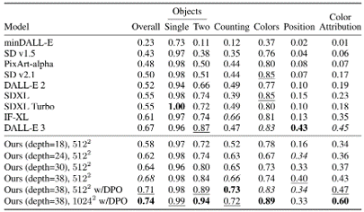

# 2024
* **GENerative Interactive Environments** (**Genie**)
  * title and link: [Genie: Generative Interactive Environments](https://arxiv.org/abs/2402.15391)
  * information: ICML 2024 best paper DeepMind
  * problem and position: the first world model learning from action-unlabeled videos
  * method overview: spatiotemporal video tokenizer, latent action model, dynamics model
  * teaser: 
    
  * results: experiments on 2D platformer games and robotics RT1
    
  * method details: 
    
    
    * video tokenizer is VQ-VAE-based to encode and decode video
      
    * latent action model is VQ-VAE-based, treat latent variable as action, limit $|A| = 8$, directly from pixels for better performance
      
    * dynamics model is a decoder-only MaskGIT on tokens with action additive instead of concat for better performance
      
    * first train video tokenizer, then co-train latent action model and dynamics model, inference discard latent action model with only action codebook
    * all components use spatiotemporal Transformer for memory efficiency
    * 11B parameters, most on 10.1B dynamics model, trained with 256 TPUv5p

* **Video Poet** (**VideoPoet**)
  * title and link: [VideoPoet: A Large Language Model for Zero-Shot Video Generation](https://arxiv.org/abs/2312.14125)
  * information: ICML 2024 best paper Google
  * problem and position: LLM-based video generation
  * method overview: modality-specific tokenizers, decoder-only autoregressive Transformer, super-resolution Transformer
  * teaser: 
    
  * results: 
    
  * method details: 
    * decoder-only Transformer backbone for autoregressive generation
    * modality-specific tokenizers to map into unified space
      * text: pretrained frozen T5 XL encoder
      * image and video: MAGVIT-v2 tokenizer
      * audio: pretrained SoundStream tokenizer
    
    * super-resolution Transformer with window attention
      
    * pretraining task mixture, finetune on text2video

* **Stable Diffusion 3** (**SD3**)
  * title and link: [Scaling Rectified Flow Transformers for High-Resolution Image Synthesis](https://arxiv.org/abs/2403.03206)
  * information: ICML 2024 best paper Stability
  * problem and position: improve rectified flow Transformers for text2image
  * method overview: middle-frequent sampling for rectified flow, multi-modal DiT
  * results: 
    
    
  * Rectified Flow forward process but with more frequent sampling for middle timesteps training
  * MM-DiT builds upon DiT
    
  * 8B parameters
  * scaling law
    

* **Universal Manipulation Interface** (**UMI**)
  * title and link: [Universal Manipulation Interface: In-The-Wild Robot Teaching Without In-The-Wild Robots](https://arxiv.org/abs/2402.10329)
  * information: RSS 2024 outstanding systems paper Stanford (Shuran Song)
  * problem and position: portable and low-cost and in-the-wild robotics data collection by human
  * method overview: soft-gripper with camera and IMU
  * results: 
    
  * method details: 
    * teleoperation high cost, human video large gap
    * hand-held soft gripper, but with fisheye camera and side mirrors, GoPro IMU pose tracking, marker for width detection
    * filtered unreachable data by forward kinematics
    * raw fisheye images without undistortion as input
    * reflecting the crops in the mirrors works better for policy learning
    
    * synchronized RGB images, relative gripper pose and width as inputs, delayed relative gripper pose and width as outputs
    * Diffusion Policy imitation learning
    

* **Fast-Slow LLM Anomaly Detection** (**AESOP**)
  * title and link: [Real-Time Anomaly Detection and Reactive Planning with Large Language Models](https://arxiv.org/abs/2407.08735)
  * information: RSS 2024 outstanding paper Stanford
  * problem and position: robotics anomaly detection
  * method overview: fast-stage LLM embedding similarity with dataset to threshold anomaly, slow-stage LLM reasoning to select continue or any predefined recovery strategy, MPC with both nominal and recovery objective
    
  * results: not standard benchmark, self comparison

* **Generalized Winding Numbers** (**GWN**)
  * title and link: [Robust Containment Queries over Collections of Rational Parametric Curves via Generalized Winding Numbers](https://arxiv.org/abs/2403.17371)
  * information: SIGGRAPH 2024 best paper
  * problem and position: extend point containment query to non-watertight 2D rational parametric curves by generalized winding numbers
  * method overview: generalized winding numbers by winding angles, practical calculation by recursive closure with lines, coincidence by tangent
    
    
    
  * teaser: 
    

* **Generative Image Dynamics** (**GID**)
  * title and link: [Generative Image Dynamics](https://arxiv.org/abs/2309.07906)
  * information: CVPR 2024 best paper Google
  * problem and position: model image-space motion for turning single image to looping video or interactive demo
  * method overview: diffusion model predicts Fourier domain spectral volumes, Fourier transform to warp motioned future frames
  * teaser: 
    
  * results: 
    
    
  * method details: 
    * motion texture as 2D displacement maps $\{F_t \mid I_t(\mathbf{p} + F_t(\mathbf{p})) = I_0(\mathbf{p}), t = 1, \ldots, T\}$
    * directly predicting motion texture scales with $T$
    * Fast Fourier Transform to frequency domain $S(\mathbf{p}) = FFT(F(\mathbf{p}))$ and only low-freq $K = 16$ enough
    * latent diffusion model predicts $4K$-channel 2D motion spectrum map, with $4$ Fourier coefficients each frequency
      
    * normalization for stable training concentrates to low-freq, so normalize per frequency
      
      
    * directly outputting $4K$ channels yields over-smoothed results, so first train conditioning on frequency embedding to predict single $4$-channel coefficients, then freeze and insert attention layers for coordinating different frequencies and fine-tune
    * rendering with additional multi-scale ResNet-34 features soft-warped by $F_t = FFT^{-1}(\hat{S})$ and $W = \frac{1}{T} \sum_t \|F_t\|_2$ to decode
      
    * train from scratch for 6 days with 16 A100s
    * collect 3015 videos as >150k image-motion pairs

* **Rich Automatic Human Feedback** (**RAHF**)
  * title and link: [Rich Human Feedback for Text-to-Image Generation](https://arxiv.org/abs/2312.10240)
  * information: CVPR 2024 best paper Google
  * problem and position: fine-grained human feedback on text-image alignment for text2image generation
  * method overview: fine-grained annotated text-image alignment dataset and transformer model to predict the human feedbacks
  * results: can help text2image generation models
  * method details: 
    * RichHF-18K dataset from Pick-a-Pic
    * marking image regions, marking text words, annotating rate
      
    * multimodal transformer with multiple heads
      
    * finetune Muse on the self-generated images with high RAHF-predicted score
    * Muse inpainting with RAHF-predicted implausibility heatmap

* **NavigatiOn with goal MAsked Diffusion** (**NoMaD**)
  * title and link: [NoMaD: Goal Masked Diffusion Policies for Navigation and Exploration](https://arxiv.org/abs/2310.07896)
  * information: ICRA 2024 best paper UCBerkeley (Sergey Levine)
  * problem and position: single network for goal-directed navigation and goal-agnostic exploration
  * method overview: Transformer encoder with optional goal condition masking for observed images and diffusion policy for future actions
  * results: 
    
    
  * method details: 
    * ViNT as the encoder backbone for goal-conditioned navigation
    * ViKiNG’s topological graph for goal-free exploration
    * 50% probability goal masking during training
    * 1D conditional UNet as the diffusion policy
    * train on combination of GNM and SACSoN datasets
    

* **Robotics Transformer X** (**RT-X**)
  * title and link: [Open X-Embodiment: Robotic Learning Datasets and RT-X Models](https://arxiv.org/abs/2310.08864)
  * information: ICRA 2024 best paper 44 institutions
  * problem and position: union of open-source robotics datasets and attempt to general training
  * method overview: RT-1 and RT-2 on Open X-Embodiment dataset
  * teaser: 
    
  * results: 
    

* **Universal Simulator** (**UniSim**)
  * title and link: [Learning Interactive Real-World Simulators](https://arxiv.org/abs/2310.06114)
  * information: ICLR 2024 outstanding paper UCBerkeley (Pieter Abbeel)
  * problem and position: action-conditioned video prediction enables robot learning
  * method overview: accept language, motor action, camera motions as actions, then action-conditioned video diffusion model
  * teaser: 
    
  * results: used for high-level VLM policy and low-level RL policy training
  * method details: 
    * different video datasets cover different information
      
    * texts by T5 language embedding, motor actions, camera motions
    * video 3D UNet diffusion model predicts next frames conditioned on observed frames and actions autoregressively
    * action-condition by classifier-free guidance
    * 5.6B parameters
    * experiment PaLM-E image-goal conditioned VLM policy and PaLI VLA policy with learned reward function for block rearrangement on 10k generated videos
