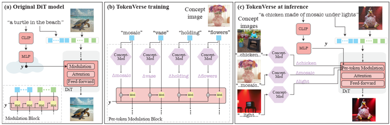
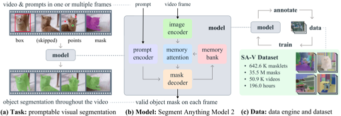

# 2025
* **Visual Geometry Grounded Transformer** (**VGGT**)
  * title and link: [VGGT: Visual Geometry Grounded Transformer](https://arxiv.org/abs/2503.11651)
  * information: CVPR 2025 best paper Oxford
  * problem and position: feed-forward 3D reconstruction
  * method overview: Transformer input a set of images, output camera parameters, depth maps, point maps and point tracks
  * results: under 1 seconds, from 1 to hundreds of images, still out-perform those requiring post-processing
    
    
  * method details: 
    * input a set of images, encoded by DINOv2, fused by self-attention Transformer
    * predict each camera translation, quaternion and field of view, by MLP on camera tokens
    * predict each depth map, by DPT
    * predict each point map in the frame of first image, by DPT
    * predict each dense tracking features, by DPT and CoTracker2
    * these predictions are redundant, but bring performance gain
    

* **Component-Aligned Scene reconsTruction** (**CAST**)
  * title and link: [CAST: Component-Aligned 3D Scene Reconstruction from an RGB Image](https://arxiv.org/abs/2502.12894)
  * information: SIGGRAPH 2025 best paper ShanghaiTech (Jiayuan Gu, Jingyi Yu)
  * problem and position: 3D scene reconstruction from a single image where objects are posed precisely and interact naturally
  * method overview: use foundation models to first parse image, then diffusion-based generative model produces object meshes and aligns poses, and use inter-object relation as cost functions to optimize object poses
  * results: 
    
  * method details: 
    
    * first use foundation models to parse image
      * Florence-2 to detect objects with bounding boxes and descriptions
      * GPT-4v to filter out spurious detections and isolate meaningful objects
      * GroundedSAMv2 to get segmentation masks
      * MoGe to predict point maps
    * object mesh generative model builds upon 3DShape2VecSet, pre-train on Objaverse
      * VAE architecture, encode image and point cloud, diffusion on latent code, then decode as SDF
        
      * address occlusion by training with randomly masks
    * pose alignment diffusion-based generative model inputs scene point cloud and object latent code, outputs corresponding aligned-with-mesh point cloud
      
      * use Umeyama algorithm to recover the transformation matrix
    * iteratively alternate these two models, since initially no aligned-with-mesh point cloud available for object mesh model
    * further optimize object poses since not perfect estimated and not considered for inter-object relations
      * minimize custom costs depending on inter-object relations
        * contact-relation cost: encourage no penetration and at least one contact point
        * support-relation cost: encourage supported object stay close to the supporting
      * use GPT-4v to infer the inter-object relations

* **TokenVerse** (**TokenVerse**)
  * title and link: [TokenVerse: Versatile Multi-concept Personalization in Token Modulation Space](https://arxiv.org/abs/2501.12224)
  * information: SIGGRAPH 2025 best paper DeepMind
  * problem and position: generate combinations of multi-concepts from multiple images
  * method overview: learn modulation direction for each concept token by training an additional MLP to predict it then add it to modulate
  * teaser: 
    
  * results: 
    
    
  * method details: 
    * intuitively add an attribute-aware direction to the modulation of all tokens, but not localized
      
      
    * so just add the direction to the modulation of the text token we want to affect
    * train Concept-Mod which is a small MLP to predict the direction for each token in concept image-text
      
    * training loss is the same as original diffusion loss, but add two tricks
      * 50% training adds an additional concept isolation loss to encourage the learned directions not to influence other concepts not in the concept image, as L2 loss on a generated auxiliary image by added directions and original generation
        
      * additional MLP in each diffusion block to predict per-token per-block direction, added with per-token Concept-Mod
    

* **Robot Data Management** (**Robo-DM**)
  * title and link: [Robo-DM: Data Management For Large Robot Datasets](https://arxiv.org/abs/2505.15558)
  * information: ICRA 2025 best robot learning paper UCBerkeley
  * problem and position: robot dataset management
  * method overview: use EBML with byte packets to be self-contained, use mmap for efficient random access decoding caches
    
  * results: compression saves space by 70x (lossy) and 3.5x (lossless) compared to RLDS, decoding 50x faster than LeRobot

* **Human-level Robot Table Tennis** (**HRTT**)
  * title and link: [Achieving Human Level Competitive Robot Table Tennis](https://arxiv.org/abs/2408.03906)
  * information: ICRA 2025 best robot learning paper finalist DeepMind
  * problem and position: first amateur human-level table tennis robot
  * method overview: high-level skill selector and low-level skill executors, train in simulation and iteratively transfer to real-world
  * results: robot won 13/29 matches with humans of different levels
  * method details: 
    * use high-speed camera and perception to estimate ball position, use motion capture to track opponent’s paddle, in real-world
    * train in MuJoCo simulation with high-fidelity system identification and domain randomization, and iteratively train on evaluated real-world collected data with 7 cycles
    * state-based policy instead of vision-based, one episode as one hit
    * high-level controller select multiple low-level controller to execute
    
    * low-level controllers act at 50Hz for producing joint velocity
      * train in simulation by BGS
      * 1D CNN, input 8 timesteps of ball 3D position and velocity and robot joint positions, output 8 timesteps of robot joint velocities
      * first train 2 generalist base policies for forehand and backhand styles, then finetune from them to specialist policies, leading to 17 skills
      * maintain skill descriptors like the performance metadata
    * high-level controller acts when opponent hits the ball within 20ms
      * train to predict forehand or backhand style, same input as low-level
      * train to classify topspin or underspin, input ball and paddle state
      * 5 heuristic strategies to shortlist some low-level controllers
      * estimate and update online preference of each low-level skill

* **PolyTouch** (**PolyTouch**)
  * title and link: [PolyTouch: A Robust Multi-Modal Tactile Sensor for Contact-rich Manipulation Using Tactile-Diffusion Policies](https://arxiv.org/abs/2504.19341)
  * information: ICRA 2025 best field and service robotics paper MIT (Edward Adelson)
  * problem and position: multi-modal robot finger with tactile, acoustic and peripheral vision
  * method overview: design a new tactile robot finger and tactile diffusion policy
  * teaser: 
    
  * results: 
    
  * method details: 
    
    * camera-based tactile sensing with a curved mirror
    * contact microphone-based acoustic sensing
    * peripheral vision sensing with the same camera
    
    * diffusion policy with each modality encoder and concatenated projection
    * interesting finding: training robotic policies with more modalities require more data

* **Human-Agent Joint Learning** (**HAJL**)
  * title and link: [Human-Agent Joint Learning for Efficient Robot Manipulation Skill Acquisition](https://arxiv.org/abs/2407.00299)
  * information: ICRA 2025 best human-robot interaction paper SJTU (Cewu Lu)
  * problem and position: human-robot shared control during teleoperation to reduce effort
  * method overview: first human operators teleoperate to gather initial dataset for training diffusion policy, then human-policy shared control by diffusing and denoising human action, and gradually increase policy control ratio, collect data while finetune policy
    
  * results: 
    

* **Unsupervised Affordance Distillation** (**UAD**)
  * title and link: [UAD: Unsupervised Affordance Distillation for Generalization in Robotic Manipulation](https://arxiv.org/abs/2506.09284)
  * information: ICRA 2025 best robot perception paper finalist Stanford (Jiajun Wu, Li Fei-Fei)
  * problem and position: use VLM to annotate affordance dataset without manual annotation
  * method overview: VLM annotates <instruction, affordance>, then train affordance model, then use affordance as condition for imitation learning
  * results: 
    
    
    
  * method details: 
    
    * render object images and point clouds
    * extract 2D DINOv2 features and fuse into 3D point clouds, then PCA to reduce dimension and then cluster into regions
    * query GPT-4o to propose a set of task instructions given the image and regions, then associate the instruction and region
    * affordance model as DINOv2 backbone conditioned by FiLM with language embedding
    * imitation learning policy uses affordance map as input

* **$\mathcal{D(R,O)}$ Grasp** (**DRO-Grasp**)
  * title and link: [$\mathcal{D(R,O)}$ Grasp: A Unified Representation of Robot and Object Interaction for Cross-Embodiment Dexterous Grasping](https://arxiv.org/abs/2410.01702)
  * information: ICRA 2025 best robot manipulation and locomotion paper NUS (Lin Shao)
  * problem and position: cross-embodiment and efficient dexterous grasp
  * method overview: model predicts $\mathcal{D(R,O)}$, then compute joint values from it
  * teaser: 
    
  * results: 
    
  * method details: 
    * $\mathcal{D(R,O)}$ represents the distance between robot hand and object point clouds, which implicitly presents the grasp pose
    * point cloud feature extraction by DGCNN and then cross-attention Transformer
    * CVAE to concatenate latent configuration variable to the features
    * a kernel function to compute $\mathcal{D(R,O)}$
      
    * configuration-invariant pretraining robot point cloud encoder by open-hand and close-hand point-level contrastive learning
    * generate grasp pose point cloud from $\mathcal{D(R,O)}$ by least-squares optimizing distances
    * generate 6D link poses by registration of grasp and canonical point clouds
    * generate joint values by optimization like IK
    

* **Segment Anything Model 2** (**SAM2**)
  * title and link: [SAM 2: Segment Anything in Images and Videos](https://arxiv.org/abs/2408.00714)
  * information: ICLR 2025 outstanding paper honorable mention FAIR (Ross Girshick)
  * problem and position: foundation model on promptable segmentation in images and videos
  * method overview: model behaves like SAM but adds memory attention to support video, public SA-V dataset
  * teaser: 
    
  * results: 
    
    
  * method details: 
    * image encoder uses an MAE pretrained Hiera to extract features
    * memory attention uses Transformer as self-attention and cross-attention to memory bank
    * prompt encoder as SAM
    * mask decoder similar to SAM, with additional head predicting whether object of interest is present on current frame
    * memory encoder fuses output mask and image features with CNN
    * memory bank as two FIFO queues of $N$ recent frames and $M$ prompted frames
    * train by simulating the interactive prompting
    * build a data engine and collect SA-V dataset
