# 2026
* **OmniRetarget** (**OmniRetarget**)
  * title and link: [OmniRetarget: Interaction-Preserving Data Generation for Humanoid Whole-Body Loco-Manipulation and Scene Interaction](https://arxiv.org/abs/2509.26633)
  * information: ICRA 2026 best paper Amazon (Angjoo Kanazawa, Pieter Abbeel, Carmelo Sferrazza, C. Karen Liu, Rocky Duan, Guanya Shi)
  * problem and position: retargeting with robot-object-terrain interaction preserved
  * method overview: build interaction mesh, and optimize interaction similarity, instead of robot keypoint matching
  * results: 
    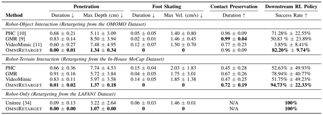
    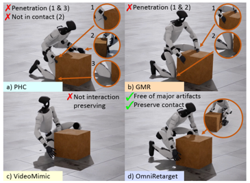
  * method details: 
    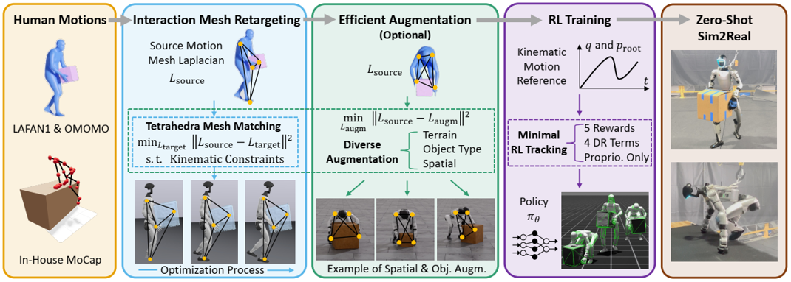
    * interaction mesh as a graph whose vertices consist of key robot or human joints together with points sampled from objects and terrains
    * optimize the robot configuration to minimize the Laplacian coordinate difference between human and robot interaction mesh
    * minimal DeepMimic RL training on the retargeted trajectories

* **Efficient Tactile simulation** (**ETac**)
  * title and link: [ETac: A Lightweight and Efficient Tactile Simulation Framework for Learning Dexterous Manipulation](https://arxiv.org/abs/2604.20295)
  * information: ICRA 2026 best student paper ShanghaiTech
  * problem and position: efficient tactile simulation framework
  * method overview: build PointNet to predict displacements and supervise from FEM
  * teaser: 
    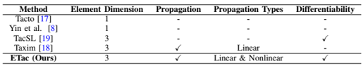
  * results: support 4096 parallel environments at 869 FPS on a 4090 GPU
    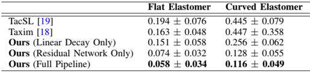
    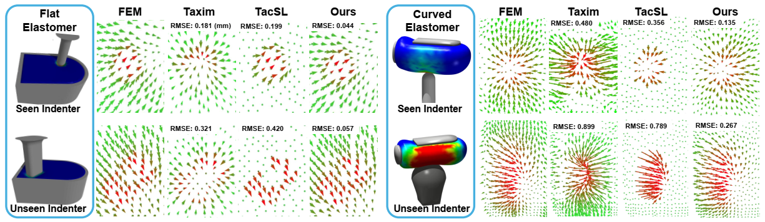
  * method details: 
    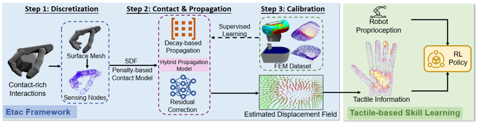
    * active nodes' displacements are modeled by penalty-based contact model
    * passive nodes' displacements are propagated, modeled by a decay-based analytical linear model with a learnable parameter, and PointNet residual correction, supervised by FEM simulation
      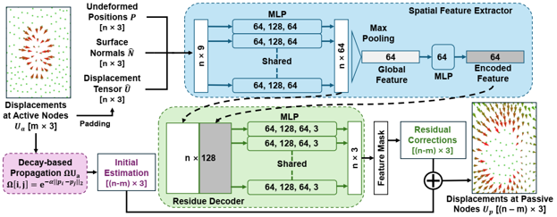

* **3D Foundation Policy** (**FP3**)
  * title and link: [FP3: A 3D Foundation Policy for Robotic Manipulation](https://arxiv.org/abs/2503.08950)
  * information: ICRA 2026 best robot learning paper finalist Tsinghua (Yang Gao)
  * problem and position: 3D point cloud VLA
  * method overview: Uni3D point cloud encoder + CLIP text encoder, then Transformer encoder, then DiT decoder, pretrain on DROID and finetune
  * results: 
    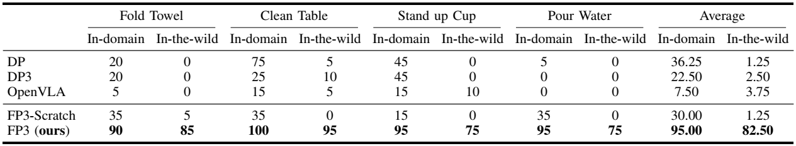

* **Dexora** (**Dexora**)
  * title and link: [Dexora: Open-source VLA for High-DoF Bimanual Dexterity](https://arxiv.org/abs/2605.18722)
  * information: ICRA 2026 best robot manipulation and locomotion paper finalist Tsinghua (Yao Mu, Jiayuan Gu, Hao Dong, Huazhe Xu, Li Yi, Hang Zhao, Shanghang Zhang, Jianyu Chen, Hongyang Li, Hao Zhao)
  * problem and position: VLA for natively bimanual high-DoF dexterity
  * method overview: run the full pipeline, from data collection devices, dataset construction, to model training and evaluation
  * results: 
    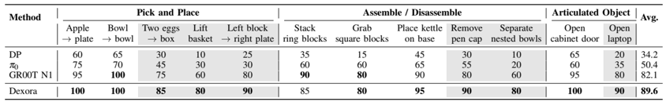
    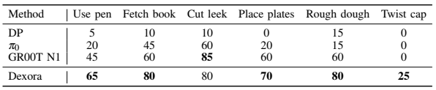

* **Bimanual Adaptation** (**Bi-Adapt**)
  * title and link: [Bi-Adapt: Few-shot Bimanual Adaptation for Novel Categories of 3D Objects via Semantic Correspondence](https://arxiv.org/abs/2602.08425)
  * information: ICRA 2026 best robot manipulation and locomotion paper finalist NUS (Lin Shao)
  * problem and position: cross-category object affordance transfer
  * method overview: Where2Act pretrains, DIFT transfers affordance points, Where2Act proposes actions on new categories, interaction and finetune Where2Act
    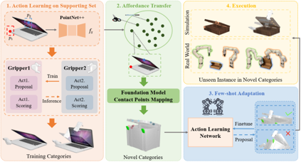
  * results: 
    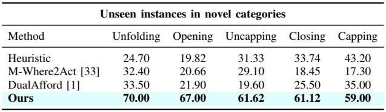

* **Lost in Conversation** (**LostConversation**)
  * title and link: [LLMs Get Lost In Multi-Turn Conversation](https://arxiv.org/abs/2505.06120)
  * information: ICLR 2026 outstanding paper Microsoft
  * problem and position: empirical analysis on multi-turn conversations for LLM
  * method overview: simulate multi-turn underspecified conversations by sharding single-turn benchmark
  * teaser: 
    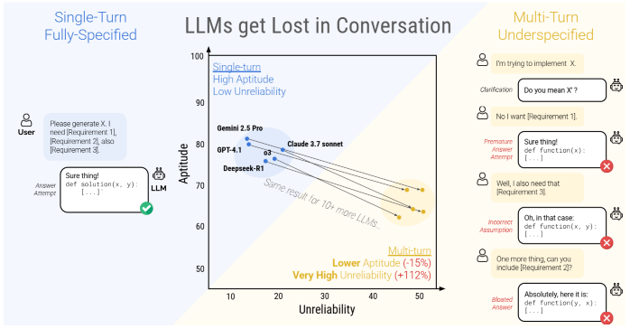
