# 2026
* **Dynamic 4D Reconstruction and Tracking** (**D4RT**)
  * title and link: [Efficiently Reconstructing Dynamic Scenes One D4RT at a Time](https://arxiv.org/abs/2512.08924)
  * information: CVPR 2026 best paper DeepMind
  * problem and position: unify dynamic 4D reconstruction and tracking into a feed-forward model
  * method overview: formulate as predicting any pixel’s 3D position in space and time from video
  * teaser: 
    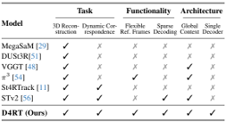
  * results: 
    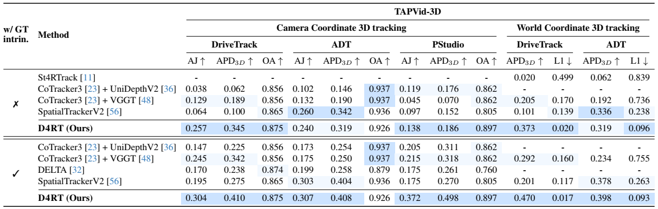
    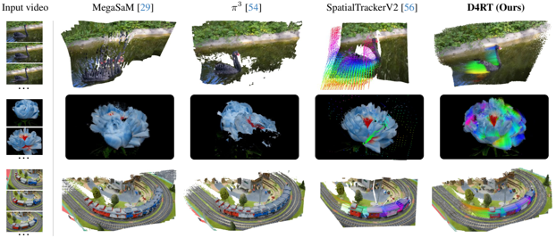
  * method details: 
    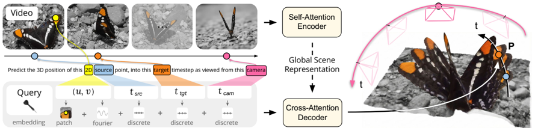
    * unified as query, $V \in R^{T \times H \times W \times 3}$, $F = E(V) \in R^{N \times C}$, $q = (u, v, t_{src}, t_{tgt}, t_{cam})$, $P = D(q, F) \in R^3$
      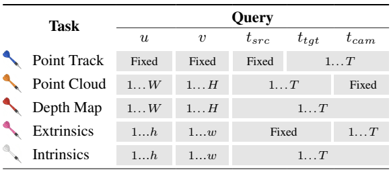
    * encoder like VGGT encoder, decoder as a small cross-attention transformer
    * train on 64 TPUs for 2 days

* **Omni-Voxel representation** (**O-Voxel**)
  * title and link: [Native and Compact Structured Latents for 3D Generation](https://arxiv.org/abs/2512.14692)
  * information: CVPR 2026 best student paper Microsoft
  * problem and position: better native 3D representation, support both arbitrary geometry and arbitrary appearance, even open, non-manifold and fully-enclosed surfaces, and PBR textures, for 3D generation
  * method overview: develop a bidirectional conversion between mesh and voxel representation
  * results: 
    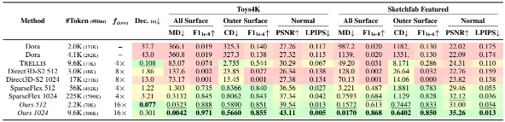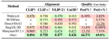
    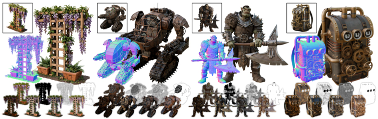
  * method details: 
    * voxel representation with shape $f^{shape}$ and material $f^{mat}$ features
    * conversion between textured mesh and O-Voxel is computation, like Dual Contouring
      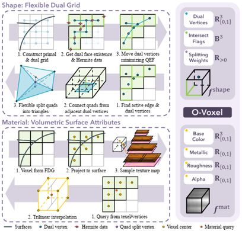
    * fully convolutional VAE reconstruction to compress 16x to latents
      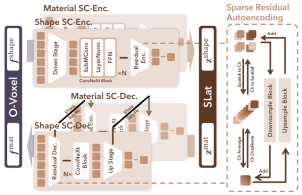
    * image-to-3D generative model on latents like TRELLIS

* **SAM 3D** (**SAM3D**)
  * title and link: [SAM 3D: 3Dfy Anything in Images](https://arxiv.org/abs/2511.16624)
  * information: CVPR 2026 best paper honorable mention Meta (Jitendra Malik)
  * problem and position: reconstruct the 3D scene made of individual objects with geometry, texture and layout from a single image
  * method overview: TRELLIS-like backbone, pre-mid-post training recipe, self-boosting data engine
  * results: 
    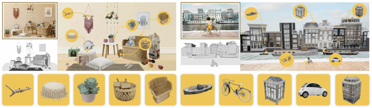
    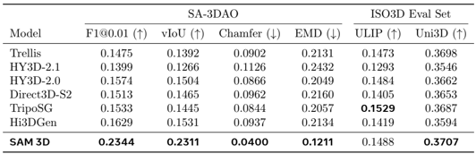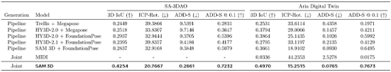
  * method details: 
    * given 2D image $I$ and object mask $M$, predict object shape $S$, texture $T$, and rotation, translation and scale in camera coordinate $(R, t, s)$, i.e. predict objects one at a time
    * architecture like TRELLIS, irrelevant to SAM
      * DINOv2 as image encoder
      * 1.2B latent flow matching MoT for pose and coarse voxel shape
      * 600M latent flow flow matching transformer and VAE decoders for mesh and 3D Gaussian splats
      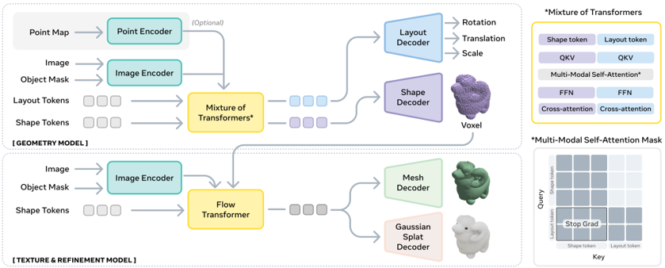
    * pre-training on synthetic data for basic generation capability
    * mid-training on render-paste data for mask-following, occlusion-aware, and layout estimation capabilities
    * post-training on natural data for adapting to real-world and aligning human preference
      * supervised fine-tuning + direct preference optimization
      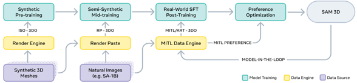
    * iterative data engine for natural data
      * collect data with latest model and human, update model with latest data
      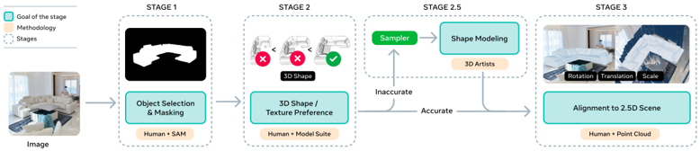

* **VGGT-$\Omega$** (**VGGT-Omega**)
  * title and link: [VGGT-$\Omega$](https://arxiv.org/abs/2605.15195)
  * information: CVPR 2026 best paper finalist Oxford
  * problem and position: scale up VGGT
  * method overview: optimize some architectures of VGGT for efficiency, scale up data, support dynamic scenes, add self-supervised learning
  * teaser: 
    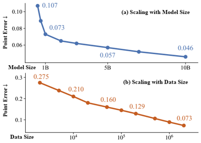
  * results: 
    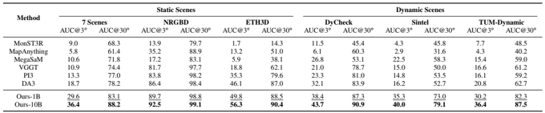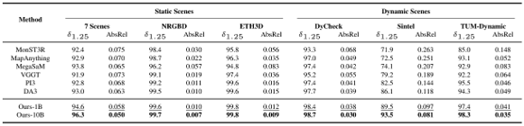
    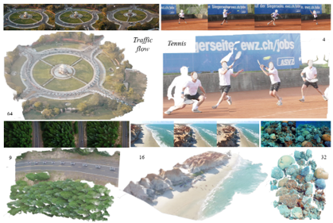
  * method details: 
    * input a set of images, encoded by DINOv3, fused by self-attention Transformer
    * each image with 1 camera token and 16 scene tokens (registers)
    * predict each camera translation, quaternion and field of view, and each depth map, but not predict point maps and tracking features directly, but still supervise with corresponding losses
    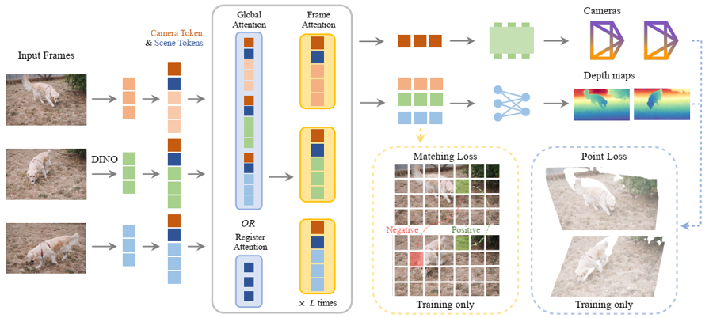
    * replace 25% global attention layers with only register attention
    * replace convolutional blocks over 1/4 resolutions in DPT with MLPs
    * train with camera, depth, point, and matching losses
    * support reconstructing dynamic scenes
    * DINO-like teacher-student self-supervised learning on unlabeled videos
    * collect 4M annotated sequences and 40M unlabeled sequences
    * train by 128 H100 GPUs

* **OmniRetarget** (**OmniRetarget**)
  * title and link: [OmniRetarget: Interaction-Preserving Data Generation for Humanoid Whole-Body Loco-Manipulation and Scene Interaction](https://arxiv.org/abs/2509.26633)
  * information: ICRA 2026 best paper Amazon (Angjoo Kanazawa, Pieter Abbeel, Carmelo Sferrazza, C. Karen Liu, Rocky Duan, Guanya Shi)
  * problem and position: retargeting with robot-object-terrain interaction preserved
  * method overview: build interaction mesh, and optimize interaction similarity, instead of robot keypoint matching
  * results: 
    
    
  * method details: 
    
    * interaction mesh as a graph whose vertices consist of key robot or human joints together with points sampled from objects and terrains
    * optimize the robot configuration to minimize the Laplacian coordinate difference between human and robot interaction mesh
    * minimal DeepMimic RL training on the retargeted trajectories

* **Efficient Tactile simulation** (**ETac**)
  * title and link: [ETac: A Lightweight and Efficient Tactile Simulation Framework for Learning Dexterous Manipulation](https://arxiv.org/abs/2604.20295)
  * information: ICRA 2026 best student paper ShanghaiTech
  * problem and position: efficient tactile simulation framework
  * method overview: build PointNet to predict displacements and supervise from FEM
  * teaser: 
    
  * results: support 4096 parallel environments at 869 FPS on a 4090 GPU
    
    
  * method details: 
    
    * active nodes' displacements are modeled by penalty-based contact model
    * passive nodes' displacements are propagated, modeled by a decay-based analytical linear model with a learnable parameter, and PointNet residual correction, supervised by FEM simulation
      

* **3D Foundation Policy** (**FP3**)
  * title and link: [FP3: A 3D Foundation Policy for Robotic Manipulation](https://arxiv.org/abs/2503.08950)
  * information: ICRA 2026 best robot learning paper finalist Tsinghua (Yang Gao)
  * problem and position: 3D point cloud VLA
  * method overview: Uni3D point cloud encoder + CLIP text encoder, then Transformer encoder, then DiT decoder, pretrain on DROID and finetune
  * results: 
    

* **Dexora** (**Dexora**)
  * title and link: [Dexora: Open-source VLA for High-DoF Bimanual Dexterity](https://arxiv.org/abs/2605.18722)
  * information: ICRA 2026 best robot manipulation and locomotion paper finalist Tsinghua (Yao Mu, Jiayuan Gu, Hao Dong, Huazhe Xu, Li Yi, Hang Zhao, Shanghang Zhang, Jianyu Chen, Hongyang Li, Hao Zhao)
  * problem and position: VLA for natively bimanual high-DoF dexterity
  * method overview: run the full pipeline, from data collection devices, dataset construction, to model training and evaluation
  * results: 
    
    

* **Bimanual Adaptation** (**Bi-Adapt**)
  * title and link: [Bi-Adapt: Few-shot Bimanual Adaptation for Novel Categories of 3D Objects via Semantic Correspondence](https://arxiv.org/abs/2602.08425)
  * information: ICRA 2026 best robot manipulation and locomotion paper finalist NUS (Lin Shao)
  * problem and position: cross-category object affordance transfer
  * method overview: Where2Act pretrains, DIFT transfers affordance points, Where2Act proposes actions on new categories, interaction and finetune Where2Act
    
  * results: 
    

* **Lost in Conversation** (**LostConversation**)
  * title and link: [LLMs Get Lost In Multi-Turn Conversation](https://arxiv.org/abs/2505.06120)
  * information: ICLR 2026 outstanding paper Microsoft
  * problem and position: empirical analysis on multi-turn conversations for LLM
  * method overview: simulate multi-turn underspecified conversations by sharding single-turn benchmark
  * teaser: 
    
