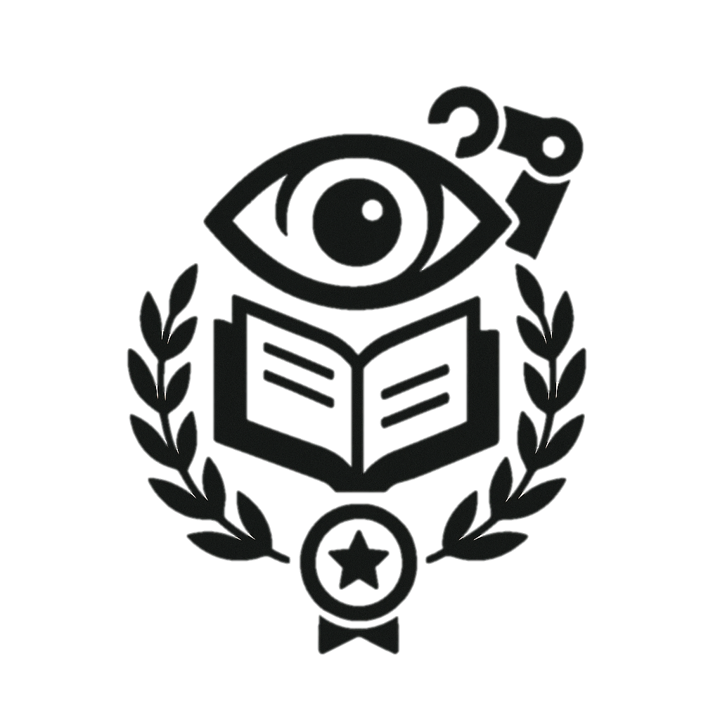

# Honors

A curated list of AI papers of interest that have received honors, focusing more on computer vision and robot learning, along with personal summary.

## Table of Contents
* [2025](2025.md)
* [2024](2024.md)
* [2023](2023.md)
* [2022](2022.md)
* [2021](2021.md)
* [2020](2020.md)
